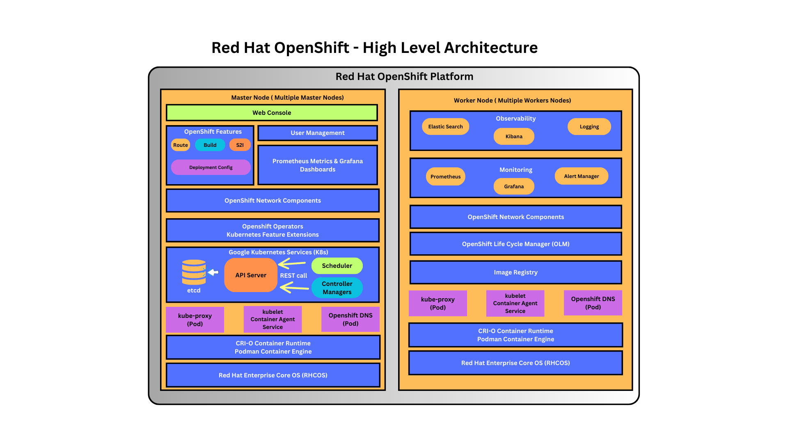
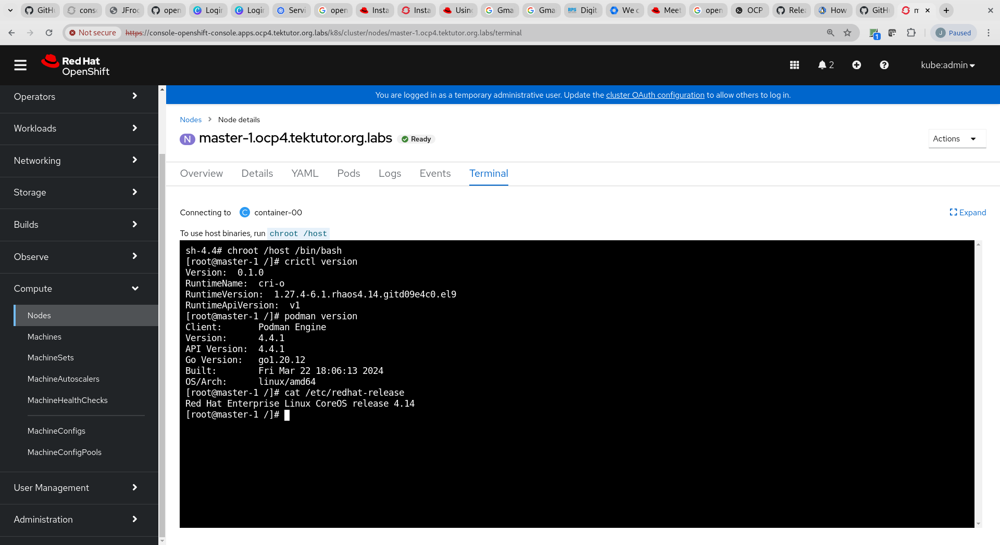

# Day 1

## First day feedback
<pre>
https://survey.zohopublic.com/zs/wn0NmU  
</pre>

## Cloning TekTutor Openshift Training Repository
```
cd ~
git clone https://github.com/tektutor/openshift-april-2024.git
cd openshift-april-2024
```

## Troubleshooting RPS Cloud Login
```
- The user-id that was shared to you seems to miss letter 'u', so you need to type your username as 24MAN0113-u25.
- The last two digit number in the username would vary for each participant.
```

## About our lab environment
- OnPrem Production grade Red Hat OpenShift setup 
- System Configuration
  - 48 virtual cores
  - 755 GB RAM
  - 17 TB HDD Storage
- CentOS 7.9.2009 64-bit OS
- KVM Hypervisor
- 7 Virtual machines
  - Master 1 with RHEL Core OS ( 8 Cores, 128GB RAM, 500 GB HDD )
  - Master 2 with RHEL Core OS ( 8 Cores, 128GB RAM, 500 GB HDD )
  - Master 3 with RHEL Core OS ( 8 Cores, 128GB RAM, 500 GB HDD )
  - Worker 1 with RHEL Core OS ( 8 Cores, 128GB RAM, 500 GB HDD )
  - Worker 2 with RHEL Core OS ( 8 Cores, 128GB RAM, 500 GB HDD )
  - HAProxy Load Balancer Virtual Machine
  - One more VM is created and destroyed during Openshift installation (BootStrap Virtual Machine)
- Linux Server 1 ( 10.10.15.60 ) - Openshift cluster 1 ( 9 participants - user01 thru user09 )
- Linux Server 2 ( 10.10.15.63 ) - Openshift cluster 2 ( 8 participants - user10 thru user17 )
- Linux Server 3 ( 10.10.15.64 ) - openshift cluster 3 ( 8 participants - user18 thru user25 )

- In case you RPS cloud login username is 24MAN0113-u01, then you should login to your respective Linux server as user01 with password 'redhat' to the Server 1 (10.10.15.60).

- In case you cloud login username 24MAN0113-u15, then you should login as user15 with password 'redhat' to the Server 2 (10.10.15.63).

- In case your RPS cloud login username is 24MAN0113-u25, then you should login to your respective Linux server as user25 with password 'redhat' to the Server 3 (10.10.15.64).

## Pre-test - kindly complete the pre-test from your RPS Lab machine
<pre>
https://app.mymapit.in/code4/tiny/8Y8cj9
</pre>

Note
<pre>
- Copy/Paste between your laptop and rps lab machine is disabled as per your bank policy
- You don't have to enable the camera access
- Kindly use your personal email-id while registering ( avoid using BOFA id )
- The link above may not work directly from your work laptop web browser
- Once you are done with the test we will start the training 
- Kindly leave a message via WebEx chat if you have access, otherwise you may tell me
</pre>

## Verifying your Linux lab machine

Check if docker community edition is pre-installed
```
docker --version
```

Expected output
<pre>
[root@tektutor.org openshift-april-2024]# docker --version
Docker version 26.0.1, build d260a54
</pre>

Check the version of oc and kubectl openshift client tools
```
oc version
kubectl version
```

Expected output
<pre>
[root@tektutor.org openshift-april-2024]# <b>oc version</b>
W0415 10:23:48.403940 1673608 loader.go:222] Config not found: /root/ocp4_cluster_ocp/install_dir/auth/kubeconfig
Client Version: 4.14.12
Kustomize Version: v5.0.1
  
[root@tektutor.org openshift-april-2024]# <b>kubectl version</b>
W0415 10:23:52.446759 1673707 loader.go:222] Config not found: /root/ocp4_cluster_ocp/install_dir/auth/kubeconfig
WARNING: This version information is deprecated and will be replaced with the output from kubectl version --short.  Use --output=yaml|json to get the full version.
Client Version: version.Info{Major:"1", Minor:"27", GitVersion:"v1.27.4", GitCommit:"286cfa5f978c4a89c776347c82fa09a232eef144", GitTreeState:"clean", BuildDate:"2024-01-29T22:50:23Z", GoVersion:"go1.20.12 X:strictfipsruntime", Compiler:"gc", Platform:"linux/amd64"}
Kustomize Version: v5.0.1  
</pre>

Check if you are able to list out the nodes in the Openshift cluster
```
oc get nodes
```
Expected output
<pre>
[root@tektutor.org openshift-april-2024]# <b>oc get nodes</b>
NAME                              STATUS   ROLES                         AGE     VERSION
master-1.ocp4.tektutor.org.labs   Ready    control-plane,master,worker   5h35m   v1.27.11+749fe1d
master-2.ocp4.tektutor.org.labs   Ready    control-plane,master,worker   5h35m   v1.27.11+749fe1d
master-3.ocp4.tektutor.org.labs   Ready    control-plane,master,worker   5h35m   v1.27.11+749fe1d
worker-1.ocp4.tektutor.org.labs   Ready    worker                        5h18m   v1.27.11+749fe1d
worker-2.ocp4.tektutor.org.labs   Ready    worker                        5h18m   v1.27.11+749fe1d  
</pre>

## Processors
- AMD/Intel they support multiple CPU cores in a single Processor
- These days, processors comes in different packaging
  - SCM (Single Chip Module) - one IC will host one Processor
  - MCM (Multiple chip Module) - one IC will host many Processors
- It is possible a single IC may support 2/4/8 Processors
- Server grade motherboards generally support many Processor Sockets
- Assume a server with 4 Sockets, each Socket is installed with a MCM Processor ( 4 Processor/socket) - a total of 16 Processors
- assume each Processor supports 128 Cores
- 16 x 128 = 2048 Physical CPU Cores
- 2048 x 2 = 4096 virtual/logical CPU Cores ( 1 Server )
- 1 Server can technically host 1000 virtual machines(Operating system)
- this kind of virtualization is called heavy-weight virtualization
  - because for each VM, we need to allocate dedicated hardware resources
    - CPU Cores
    - RAM
    - Disk/Storage 
Hyperthreading
- each physical cpu cores is seen as 2/4 virtual cores

## Hypervisor ( software + hardware )
- refers to virtualization technology
- through virtualization, we can run many OS side by side on the same physical machine(laptop/desktop/workstation/server)
- each Virtual machines refers to one fully functional operating system
- in other words, many OS can be active at the same time within a single machine
- Processor on your laptop/desktop/workstation/server should support virtualization
  - Intel (VT-X - Virtualization Feature)
  - AMD (AMD-V - Virtualization Feature)
- there are two types of Hypervisors available
  - Type 1 ( Used in Servers/Workstations - Bare-metal - don't need OS )
  - Type 2 ( Used in laptop/desktops - can be installed only top of a OS [Windows,Linux,Mac] )
- Examples
  - Type 1 Baremetal Hypervisors
    - VMWare vSpere/vCenter
  - Type 2 Hypervisors
    - VMWare Workstation (Linux,Windows)
    - VMWare Fusion (Mac OS-X)
    - Oracle VirtualBox
    - Microsoft Hyper-V
    - Parallels ( Mac OS-X)
    - KVM (Linux)

What is the minimum number of physical servers required to support 1000 Virtual Machine(VM - OS)?


## Container Overview
- an application virtualization technology
- each container represents one single application or application process
- container will host the application and its dependent libraries/software utilities, etc
- containers - there are similarities with virtual machines
  - just like virtual machines has shell, even a container may have its own shell like bash/sh,etc.,
  - just like virtual machines has their own network stack, containers also has their own network stack
  - just like virtual machines has atleast one IP address, containers also get atleast one IP address
  - just like virtual machine has its own file system, containers also has their own files system(files/folders)
- containers that runs in the same machines shares the hardware resources on the underlying operating system
- containers don't represent a OS, containers don't have their own hardware or OS kernel
- containers depends on the underlying os kernel for any OS functionality

## Container Engine
- is a high-level software that offers easy to use user-friendly commands
- without knowing low-level linux kernel features, we can easily manage images and containers
- hence, end-users tend to use Container Engines over the Container Runtime
- Container Engines interally depends on Container Runtimes to manage images and containers
- Examples
  - Docker is a Container Engine ( depends on runC Container Runtime )
  - Podman is a Container Engine ( depends on CRI-O Container Runtime )

## Container Runtime
- is a low-level software that manages images and containers
- it is not so user-friendly, hence generally end-users like us won't directly use a container runtime
- know how to
  - create a container using container image
  - stop/restart/kill/abort containers
- Examples
  - runC
  - CRI-O
  
## Linux kernel features that enable container technology
- Namespace ( containers running on the same machines are isolated from each other )
- Control Groups (CGroups)
  - this allows applying resource quota restrictions on containers
    - we can restrict how much percentage of CPU resources can be used by a container at the max
    - we can restrict how much RAM/storage a container can use at the max

## Is it possible to install Docker on Windows/Mac?
- Yes it is possible to install Docker in Windows or Mac
- When we install Docker for Windows/Mac, it also installs a thin linux-layer(Linux kernel)
- technically linux containers runs on top of Linux even in a Windows/Mac machines

## Is it possible to run .Net application within container?
- Yes it is possible
- MONO - is linux implemention of .Net Framework specification
- MONO supports running .Net applications on Linux too

## What is a Docker Image?
- it is like an ISO image we use to install Windows or Mac or Linux
- in other words, it is specification of a Docker container
- in other words, it is a blueprint of a Docker container
- using a Docker Image, we can create any number of containers
- each Container Image has an unique ID and name

## What is a Docker Container?
- Container is a running instance of a Docker image
- each container has an unique ID and unique name
- each container has an IP address, hostname, etc.,
- every container has it own port range 0 - 65535 ( it uses a port namespace )
  
## What is a Docker Container Registry?
- it is a collection of many Docker Images
- Docker supports 3 types of Registries
  1. Local Docker Registry ( it is a folder /var/lib/docker on linux )
  2. Private Docker Registry ( Sonatype Nexus or JFrog Artifactory )
  3. Docker Hub Website or Remote Registry powered by Sonatype Nexus Server

## What is a Container Orchestration Platform?
- Container Orchestration Platforms manages containers application workloads
- though we can manually create, start, stop,restart, delete containers, practically in the industry no one manages containers manually
- they offer high-availability (HA) to your containerized applications
- they offer in-built monitoring features to check health/liveliness,etc.,
- they offer in-built load balancing
- they allow exposing your applications only within your network or externally to internet via Services
- they support service discovery
- they allow scaling up/down your application workloads
- they allow upgrading/downgrading your application from one version to the other without any downtime
- Examples
  - Docker SWARM
  - Google Kubernetes
  - Red Hat OpenShift

## About Docker SWARM
- Docker Inc is the organization that developed Docker Container Engine
- Docker SWARM is Docker Inc's native orchestration platform
- Docker SWARM only supports Docker based containers
- it is not production grade container orchestration platform
- it is very light-weight, hence can be easily installed in your laptop
- it is very good for learning container orchestration concepts in general, also good for light-weight developer/qa setup but not generally used in production

## About Google Kubernetes
- open source
- production grade
- supports many different types of containers ( containerd, LXC, CRI-O, etc,,)
- supports extending Kubernetes APIs, by adding Custom Resources and Custom Controllers
  
## About Red Hat Openshift
- production grade
- paid software from Red Hat ( an IBM company )
- it is a Red Hat's distribution of Kubernetes
- it is developed on top of opensource Google Kubernetes, hence it is a super set of Google Kubernetes with some additional features
- Red Hat OpenShift has added many Customer Resources and Custom Controllers they added additional features on top of Google Kubernetes
- Unlike Kubernetes, OpenShift only supports CRI-O containers ( Podman Container Engine )
- OpenShift upto v3.x it was using Docker (runC) containers only
- OpenShift v4.x onwards it stopped support for Docker and replaced Docker with Podman(CRI-O)

## Docker High-level architecture


## Red Hat OpenShift Architecture

## Master Node - Control Plane Components
- Control Plane Components runs only on the master nodes
- Control Plane Components
  - API Server
  - etcd key/value datastore
  - Scheduler
  - Controller Managers ( Collection of many Controllers )
    - Deployment Controller
    - ReplicaSet Controller
    - ReplicationController
    - Job Controller
    - CronJob Controller
    - Endpoint Controller
    - StatefulSet Controller
    - Daemonset Controller
- In Openshift, the OS installed in master node is Red Hat Enterprise Linux Core OS (RHCOS)
- In OpenShift, the worker nodes supports either Red Hat Enterprise Linux (RHEL) or RHCOS
- It is recommended to install RHCOS on all nodes, as this supports upgrading the OS through oc commands
  
## API Server
- a collection of many REST APIs
- for every features supported by Openshift there is a bunch REST APIs
- is the heart of openshift
- all the Kubernetes/Openshift components only communicate to API server via REST calls
- API server notifies about different changes to other components in K8s/Openshift via events
- API server is the only component which stores/fetches data into the etcd database
## Scheduler

## etcd database
- key/value based data store
- it is an opensource database which can be used outside the scope of Kubernetes/Openshift
- this is where the entire cluster-state, application status, etc are stored
- each time some change happens in etcd database, API server will notify  other components about those changes via broadcasting events
  
## Controller Managers
- for every type of resource there is one controller to manage them
- controllers supports monitoring features
- they check the health of applications/resources and repairs them when required
- Whenever application is deployed via Deployment, the Deployment Controller is the one which creates the Pods for a deployment, monitors the health of the Pod and when required heals/repairs/replaces bad pods with good healthy ones

## Kubernetes/Openshift resources
- Deployment
- ReplicaSet
- Pod
- StatefulSet
- DaemonSet
- Job
- CronJob
- Service

## Kube config file
- the oc/kubectl client tools requires a config file that has connection details to the API Server(load balancer)
- the config file is generally kept in user home directory, .kube folder and the default name of kubeconfig is config
- optionally we could also use the --kubeconfig flag with the oc command to point to a config file
- it is also possible to use a KUBECONFIG environment variable to point to the config file
- Just to give an idea, it is possible that your Kubernetes/OpenShift is running in AWS/Azure but you could install oc/kubectl client tool on your laptop with a config file and still run all the oc/kubectl commands from your laptop without going to aws/azure

To print the content of kubeconfig file
```
cat ~/.kube/config
```

## About Red Hat Enterpise Core OS ( RHCOS )
- an optimized operating system created especially for the use of Container Orchestration Platforms
- each version of RHCOS comes with a specific version of Podman Container Engine and CRI-O Container Runtime
- RHCOS enforces many best practices and security features
- it allows writing to only folders the application will has read/write access
- if an application attempts to modify a read-only folder RHCOS will not allow those applications to continue running
- RHCOS also reserves many Ports for the internal use of Openshift
- User applications will not have write access to certain reserved folders, user applications are allowed to perform things as non-admin users only, only certain special applications will have admin/root access

### Points to remember
- Red Hat Openshift uses RedHat Enterprise Linux Core OS
- RHCOS has many restrictions or insists best practises
- RHEL Core OS reserves ports under 1024 for its internal use
- Many folders within the OS is made as ready only
- Any application Pod attempts to perform write operation on those restricted folders will not be allowed to run
- For detailed documentation, please refer official documentation here https://docs.openshift.com/container-platform/4.8/architecture/architecture-rhcos.html
- 
## Info - What is a Pod?
- a collection one or more containers that runs in the same openshift node
- one or more Pods represents a single application
- this is the smallest unit that can be deployed into Kubernetes/OpenShift
- IP addresses are assigned only on the Pod level, hence all containers that are part of the same Pod will have the same IP
- 
## Info - What is a ReplicaSet?
- ReplicaSet is a collection of one or more Pods
- each ReplicaSet represents a single version of some application Pods
- ReplicaSet has details like
  - desired number of Pods
  - actual number of Pods
  - Pod status
- supports scale up/down

## Info - What is a Deployment?
- Deployment represents an application that is deployed within Kubernetes/Openshift
- When we deploy an application into Kubernetes/OpenShift it creates a Deployment, ReplicaSet and one or more Pods
- Deployment is managed by Deployment Controller
- ReplicaSet is managed by ReplicaSet Controller
- Deployment manages ReplicaSet
- ReplicaSet manages Pods
- Deployment has one or more ReplicaSet
- Rolling update is supported by Deployment
  
## Getting inside master-1 node shell from Red Hat OpenShift web console


## Info - OpenShift states
https://access.redhat.com/documentation/en-us/openshift_container_platform/4.8/html/nodes/working-with-clusters#nodes-containers-events-list_nodes-containers-events

## Info - Pod Lifecycle
- Pending - Container image gets downloads or there are no Persistent Volume to bound and claim them
- Running - The Pod is scheduled to a node and all containers in the Pod are up and running
- Succeeded - All containers in the Pod have terminated succesfully and not be restarted
- Failed - All containers in the Pod have terminated but one or more containers terminated with non-zero status or was terminated by Openshift
- Unknown - For some reason, the state of the Pod could not be obtained may be there is some problem in communicating to the node where the Pod is running

## Info - Container Lifecycle
- Waiting - pulling the container image
- Running - container is running without issues
- Terminated - container in the Terminated state began execution and then either ran to completion or failed for some reason

## Lab - Finding more details about an openshift node
```
oc get nodes
oc describe node/master-1.ocp4.tektutor.org.labs
```

Expected output
<pre>
[jegan@tektutor.org ~]$ <b>oc describe node/master-1.ocp4.tektutor.org.labs</b>
Name:               master-1.ocp4.tektutor.org.labs
Roles:              control-plane,master,worker
Labels:             beta.kubernetes.io/arch=amd64
                    beta.kubernetes.io/os=linux
                    kubernetes.io/arch=amd64
                    kubernetes.io/hostname=master-1.ocp4.tektutor.org.labs
                    kubernetes.io/os=linux
                    node-role.kubernetes.io/control-plane=
                    node-role.kubernetes.io/master=
                    node-role.kubernetes.io/worker=
                    node.openshift.io/os_id=rhcos
Annotations:        machineconfiguration.openshift.io/controlPlaneTopology: HighlyAvailable
                    machineconfiguration.openshift.io/currentConfig: rendered-master-c585fd70786bf2b97debcbd4cba401bc
                    machineconfiguration.openshift.io/desiredConfig: rendered-master-c585fd70786bf2b97debcbd4cba401bc
                    machineconfiguration.openshift.io/desiredDrain: uncordon-rendered-master-c585fd70786bf2b97debcbd4cba401bc
                    machineconfiguration.openshift.io/lastAppliedDrain: uncordon-rendered-master-c585fd70786bf2b97debcbd4cba401bc
                    machineconfiguration.openshift.io/lastSyncedControllerConfigResourceVersion: 23186
                    machineconfiguration.openshift.io/reason: 
                    machineconfiguration.openshift.io/state: Done
                    volumes.kubernetes.io/controller-managed-attach-detach: true
CreationTimestamp:  Mon, 15 Apr 2024 04:49:14 +0530
Taints:             <none>
Unschedulable:      false
Lease:
  HolderIdentity:  master-1.ocp4.tektutor.org.labs
  AcquireTime:     <unset>
  RenewTime:       Mon, 15 Apr 2024 15:07:00 +0530
Conditions:
  Type             Status  LastHeartbeatTime                 LastTransitionTime                Reason                       Message
  ----             ------  -----------------                 ------------------                ------                       -------
  MemoryPressure   False   Mon, 15 Apr 2024 15:03:13 +0530   Mon, 15 Apr 2024 04:49:14 +0530   KubeletHasSufficientMemory   kubelet has sufficient memory available
  DiskPressure     False   Mon, 15 Apr 2024 15:03:13 +0530   Mon, 15 Apr 2024 04:49:14 +0530   KubeletHasNoDiskPressure     kubelet has no disk pressure
  PIDPressure      False   Mon, 15 Apr 2024 15:03:13 +0530   Mon, 15 Apr 2024 04:49:14 +0530   KubeletHasSufficientPID      kubelet has sufficient PID available
  Ready            True    Mon, 15 Apr 2024 15:03:13 +0530   Mon, 15 Apr 2024 04:53:19 +0530   KubeletReady                 kubelet is posting ready status
Addresses:
  InternalIP:  192.168.122.133
  Hostname:    master-1.ocp4.tektutor.org.labs
Capacity:
  cpu:                8
  ephemeral-storage:  51837932Ki
  hugepages-1Gi:      0
  hugepages-2Mi:      0
  memory:             15991660Ki
  pods:               250
Allocatable:
  cpu:                7500m
  ephemeral-storage:  46700096229
  hugepages-1Gi:      0
  hugepages-2Mi:      0
  memory:             14840684Ki
  pods:               250
System Info:
  Machine ID:                             132261e6b50049df9a5bf5d5db734ad5
  System UUID:                            132261e6-b500-49df-9a5b-f5d5db734ad5
  Boot ID:                                0da44812-28ae-491b-8f4d-4aa091680c58
  Kernel Version:                         5.14.0-284.59.1.el9_2.x86_64
  OS Image:                               Red Hat Enterprise Linux CoreOS 414.92.202403270157-0 (Plow)
  Operating System:                       linux
  Architecture:                           amd64
  Container Runtime Version:              cri-o://1.27.4-6.1.rhaos4.14.gitd09e4c0.el9
  Kubelet Version:                        v1.27.11+749fe1d
  Kube-Proxy Version:                     v1.27.11+749fe1d
Non-terminated Pods:                      (42 in total)
  Namespace                               Name                                                              CPU Requests  CPU Limits  Memory Requests  Memory Limits  Age
  ---------                               ----                                                              ------------  ----------  ---------------  -------------  ---
  openshift-apiserver                     apiserver-5866c9cc47-lkxbm                                        110m (1%)     0 (0%)      250Mi (1%)       0 (0%)         9h
  openshift-authentication                oauth-openshift-64b6c74df9-d54tz                                  10m (0%)      0 (0%)      50Mi (0%)        0 (0%)         9h
  openshift-cluster-node-tuning-operator  tuned-jzzfd                                                       10m (0%)      0 (0%)      50Mi (0%)        0 (0%)         10h
  openshift-cluster-storage-operator      csi-snapshot-controller-766c7998fd-n5vmf                          10m (0%)      0 (0%)      50Mi (0%)        0 (0%)         10h
  openshift-cluster-storage-operator      csi-snapshot-webhook-76bf9bd758-8vdcx                             10m (0%)      0 (0%)      20Mi (0%)        0 (0%)         10h
  openshift-controller-manager            controller-manager-857895fbc9-4w422                               100m (1%)     0 (0%)      100Mi (0%)       0 (0%)         9h
  openshift-dns                           dns-default-dhb6m                                                 60m (0%)      0 (0%)      110Mi (0%)       0 (0%)         10h
  openshift-dns                           node-resolver-xx22n                                               5m (0%)       0 (0%)      21Mi (0%)        0 (0%)         10h
  openshift-etcd                          etcd-guard-master-1.ocp4.tektutor.org.labs                        10m (0%)      0 (0%)      5Mi (0%)         0 (0%)         10h
  openshift-etcd                          etcd-master-1.ocp4.tektutor.org.labs                              360m (4%)     0 (0%)      910Mi (6%)       0 (0%)         9h
  openshift-image-registry                image-registry-985587bb7-mh6rp                                    100m (1%)     0 (0%)      256Mi (1%)       0 (0%)         10h
  openshift-image-registry                node-ca-52lpn                                                     10m (0%)      0 (0%)      10Mi (0%)        0 (0%)         10h
  openshift-ingress-canary                ingress-canary-gb8rg                                              10m (0%)      0 (0%)      20Mi (0%)        0 (0%)         10h
  openshift-ingress                       router-default-6fbc577945-78z8z                                   100m (1%)     0 (0%)      256Mi (1%)       0 (0%)         10h
  openshift-kube-apiserver                kube-apiserver-guard-master-1.ocp4.tektutor.org.labs              10m (0%)      0 (0%)      5Mi (0%)         0 (0%)         10h
  openshift-kube-apiserver                kube-apiserver-master-1.ocp4.tektutor.org.labs                    290m (3%)     0 (0%)      1224Mi (8%)      0 (0%)         9h
  openshift-kube-controller-manager       kube-controller-manager-guard-master-1.ocp4.tektutor.org.labs     10m (0%)      0 (0%)      5Mi (0%)         0 (0%)         10h
  openshift-kube-controller-manager       kube-controller-manager-master-1.ocp4.tektutor.org.labs           80m (1%)      0 (0%)      500Mi (3%)       0 (0%)         9h
  openshift-kube-scheduler                openshift-kube-scheduler-guard-master-1.ocp4.tektutor.org.labs    10m (0%)      0 (0%)      5Mi (0%)         0 (0%)         10h
  openshift-kube-scheduler                openshift-kube-scheduler-master-1.ocp4.tektutor.org.labs          25m (0%)      0 (0%)      150Mi (1%)       0 (0%)         9h
  openshift-machine-config-operator       kube-rbac-proxy-crio-master-1.ocp4.tektutor.org.labs              20m (0%)      0 (0%)      50Mi (0%)        0 (0%)         10h
  openshift-machine-config-operator       machine-config-daemon-b8pkp                                       40m (0%)      0 (0%)      100Mi (0%)       0 (0%)         10h
  openshift-machine-config-operator       machine-config-server-rplv2                                       20m (0%)      0 (0%)      50Mi (0%)        0 (0%)         10h
  openshift-marketplace                   certified-operators-cnp2v                                         10m (0%)      0 (0%)      50Mi (0%)        0 (0%)         7h23m
  openshift-marketplace                   community-operators-4xclh                                         10m (0%)      0 (0%)      50Mi (0%)        0 (0%)         101m
  openshift-monitoring                    kube-state-metrics-5c965858b8-fxl2b                               4m (0%)       0 (0%)      110Mi (0%)       0 (0%)         10h
  openshift-monitoring                    node-exporter-xks44                                               9m (0%)       0 (0%)      47Mi (0%)        0 (0%)         10h
  openshift-monitoring                    openshift-state-metrics-59c7b5fbbf-xcxdb                          3m (0%)       0 (0%)      72Mi (0%)        0 (0%)         10h
  openshift-monitoring                    prometheus-adapter-7b9975fb6d-rc689                               1m (0%)       0 (0%)      40Mi (0%)        0 (0%)         10h
  openshift-monitoring                    prometheus-operator-admission-webhook-6c4c698b7d-jkr8c            5m (0%)       0 (0%)      30Mi (0%)        0 (0%)         10h
  openshift-multus                        multus-additional-cni-plugins-jbn5z                               10m (0%)      0 (0%)      10Mi (0%)        0 (0%)         10h
  openshift-multus                        multus-n4pct                                                      10m (0%)      0 (0%)      65Mi (0%)        0 (0%)         10h
  openshift-multus                        network-metrics-daemon-drlh4                                      20m (0%)      0 (0%)      120Mi (0%)       0 (0%)         10h
  openshift-network-diagnostics           network-check-source-8c95bf67d-h4ndv                              10m (0%)      0 (0%)      40Mi (0%)        0 (0%)         10h
  openshift-network-diagnostics           network-check-target-dcqf2                                        10m (0%)      0 (0%)      15Mi (0%)        0 (0%)         10h
  openshift-network-node-identity         network-node-identity-d8q85                                       20m (0%)      0 (0%)      100Mi (0%)       0 (0%)         10h
  openshift-oauth-apiserver               apiserver-6d8bc5d48c-fd429                                        150m (2%)     0 (0%)      200Mi (1%)       0 (0%)         10h
  openshift-operator-lifecycle-manager    packageserver-7449897948-qc47c                                    10m (0%)      0 (0%)      50Mi (0%)        0 (0%)         10h
  openshift-route-controller-manager      route-controller-manager-84558d85b5-g9kj5                         100m (1%)     0 (0%)      100Mi (0%)       0 (0%)         9h
  openshift-sdn                           sdn-controller-5zmvj                                              20m (0%)      0 (0%)      70Mi (0%)        0 (0%)         10h
  openshift-sdn                           sdn-r7554                                                         110m (1%)     0 (0%)      220Mi (1%)       0 (0%)         10h
  openshift-service-ca                    service-ca-85cbb444f7-rz48b                                       10m (0%)      0 (0%)      120Mi (0%)       0 (0%)         10h
Allocated resources:
  (Total limits may be over 100 percent, i.e., overcommitted.)
  Resource           Requests      Limits
  --------           --------      ------
  cpu                1932m (25%)   0 (0%)
  memory             5706Mi (39%)  0 (0%)
  ephemeral-storage  0 (0%)        0 (0%)
  hugepages-1Gi      0 (0%)        0 (0%)
  hugepages-2Mi      0 (0%)        0 (0%)
Events:              <none>  
</pre>

## Lab - Listing nodes along with OS, node IP details
```
oc get nodes -o wide
```

Expected output
<pre>
[jegan@tektutor.org ~]$ <b>oc get node -o wide</b>
NAME                              STATUS   ROLES                         AGE   VERSION            INTERNAL-IP       EXTERNAL-IP   OS-IMAGE                                                       KERNEL-VERSION                 CONTAINER-RUNTIME
master-1.ocp4.tektutor.org.labs   Ready    control-plane,master,worker   10h   v1.27.11+749fe1d   192.168.122.133   <none>        Red Hat Enterprise Linux CoreOS 414.92.202403270157-0 (Plow)   5.14.0-284.59.1.el9_2.x86_64   cri-o://1.27.4-6.1.rhaos4.14.gitd09e4c0.el9
master-2.ocp4.tektutor.org.labs   Ready    control-plane,master,worker   10h   v1.27.11+749fe1d   192.168.122.74    <none>        Red Hat Enterprise Linux CoreOS 414.92.202403270157-0 (Plow)   5.14.0-284.59.1.el9_2.x86_64   cri-o://1.27.4-6.1.rhaos4.14.gitd09e4c0.el9
master-3.ocp4.tektutor.org.labs   Ready    control-plane,master,worker   10h   v1.27.11+749fe1d   192.168.122.205   <none>        Red Hat Enterprise Linux CoreOS 414.92.202403270157-0 (Plow)   5.14.0-284.59.1.el9_2.x86_64   cri-o://1.27.4-6.1.rhaos4.14.gitd09e4c0.el9
worker-1.ocp4.tektutor.org.labs   Ready    worker                        10h   v1.27.11+749fe1d   192.168.122.161   <none>        Red Hat Enterprise Linux CoreOS 414.92.202403270157-0 (Plow)   5.14.0-284.59.1.el9_2.x86_64   cri-o://1.27.4-6.1.rhaos4.14.gitd09e4c0.el9
worker-2.ocp4.tektutor.org.labs   Ready    worker                        10h   v1.27.11+749fe1d   192.168.122.93    <none>        Red Hat Enterprise Linux CoreOS 414.92.202403270157-0 (Plow)   5.14.0-284.59.1.el9_2.x86_64   cri-o://1.27.4-6.1.rhaos4.14.gitd09e4c0.el9  
</pre>

## Lab - Creating a new project in Openshift CLI
In the below command, replace 'jegan' with your name
```
oc new-project jegan
```

Expected output
<pre>
[jegan@tektutor.org ~]$ oc new-project jegan
Now using project "jegan" on server "https://api.ocp4.tektutor.org.labs:6443".

You can add applications to this project with the 'new-app' command. For example, try:

    oc new-app rails-postgresql-example

to build a new example application in Ruby. Or use kubectl to deploy a simple Kubernetes application:

    kubectl create deployment hello-node --image=registry.k8s.io/e2e-test-images/agnhost:2.43 -- /agnhost serve-hostname  
</pre>

## Lab - Listing all projects within the openshift cluster
```
oc get projects
```

Expected output
<pre>
[jegan@tektutor.org ~]$ <b>oc get projects</b>
NAME                                               DISPLAY NAME   STATUS
default                                                           Active
jegan                                                             Active
kube-node-lease                                                   Active
kube-public                                                       Active
kube-system                                                       Active
openshift                                                         Active
openshift-apiserver                                               Active
openshift-apiserver-operator                                      Active
openshift-authentication                                          Active
openshift-authentication-operator                                 Active
openshift-cloud-controller-manager                                Active
openshift-cloud-controller-manager-operator                       Active
openshift-cloud-credential-operator                               Active
openshift-cloud-network-config-controller                         Active
openshift-cluster-csi-drivers                                     Active
openshift-cluster-machine-approver                                Active
openshift-cluster-node-tuning-operator                            Active
openshift-cluster-samples-operator                                Active
openshift-cluster-storage-operator                                Active
openshift-cluster-version                                         Active
openshift-config                                                  Active
openshift-config-managed                                          Active
openshift-config-operator                                         Active
openshift-console                                                 Active
openshift-console-operator                                        Active
openshift-console-user-settings                                   Active
openshift-controller-manager                                      Active
openshift-controller-manager-operator                             Active
openshift-dns                                                     Active
openshift-dns-operator                                            Active
openshift-etcd                                                    Active
openshift-etcd-operator                                           Active
openshift-host-network                                            Active
openshift-image-registry                                          Active
openshift-infra                                                   Active
openshift-ingress                                                 Active
openshift-ingress-canary                                          Active
openshift-ingress-operator                                        Active
openshift-insights                                                Active
openshift-kni-infra                                               Active
openshift-kube-apiserver                                          Active
openshift-kube-apiserver-operator                                 Active
openshift-kube-controller-manager                                 Active
openshift-kube-controller-manager-operator                        Active
openshift-kube-scheduler                                          Active
openshift-kube-scheduler-operator                                 Active
openshift-kube-storage-version-migrator                           Active
openshift-kube-storage-version-migrator-operator                  Active
openshift-machine-api                                             Active
openshift-machine-config-operator                                 Active
openshift-marketplace                                             Active
openshift-monitoring                                              Active
openshift-multus                                                  Active
openshift-network-diagnostics                                     Active
openshift-network-node-identity                                   Active
openshift-network-operator                                        Active
openshift-node                                                    Active
openshift-nutanix-infra                                           Active
openshift-oauth-apiserver                                         Active
openshift-openstack-infra                                         Active
openshift-operator-lifecycle-manager                              Active
openshift-operators                                               Active
openshift-ovirt-infra                                             Active
openshift-route-controller-manager                                Active
openshift-sdn                                                     Active
openshift-service-ca                                              Active
openshift-service-ca-operator                                     Active
openshift-user-workload-monitoring                                Active
openshift-vsphere-infra                                           Active  
</pre>

## Lab - Finding the currently active project
```
oc project
```

Expected output
<pre>
[jegan@tektutor.org ~]$ oc project
Using project "jegan" on server "https://api.ocp4.tektutor.org.labs:6443".  
</pre>

## Lab - Switching between projects
```
oc project
oc project default
oc project jegan
```

Expected output
<pre>
[jegan@tektutor.org ~]$ oc project
Using project "jegan" on server "https://api.ocp4.tektutor.org.labs:6443".
[jegan@tektutor.org ~]$ oc project default
Now using project "default" on server "https://api.ocp4.tektutor.org.labs:6443".
[jegan@tektutor.org ~]$ oc project jegan
Now using project "jegan" on server "https://api.ocp4.tektutor.org.labs:6443".  
</pre>

## Lab - Deleting a project
When we delete a project, all the resources created within the project will be automatically deleted.

Replace 'jegan' with your name
```
oc get projects | grep jegan
oc delete project/jegan
oc get projects | grep jegan
```

Expected output
<pre>
[jegan@tektutor.org ~]$ oc delete project/jegan
project.project.openshift.io "jegan" deleted
[jegan@tektutor.org ~]$ oc get projects | grep jegan
[jegan@tektutor.org ~]$ 
</pre>


## Lab - Creating a new-project and deploying an application
Replace 'jegan' with your name

```
oc new-project jegan
oc create deploy nginx --image=nginx:latest

oc get deployments
oc get deployment
oc get deploy
```

Expected output
<pre>
[jegan@tektutor.org ~]$ oc new-project jegan
Already on project "jegan" on server "https://api.ocp4.tektutor.org.labs:6443".

You can add applications to this project with the 'new-app' command. For example, try:

    oc new-app rails-postgresql-example

to build a new example application in Ruby. Or use kubectl to deploy a simple Kubernetes application:

    kubectl create deployment hello-node --image=registry.k8s.io/e2e-test-images/agnhost:2.43 -- /agnhost serve-hostname

[jegan@tektutor.org ~]$ oc create deploy nginx --image=nginx:latest
deployment.apps/nginx created
  
[jegan@tektutor.org ~]$ oc get deployments
NAME    READY   UP-TO-DATE   AVAILABLE   AGE
nginx   0/1     1            0           37s
  
[jegan@tektutor.org ~]$ oc get deployment
NAME    READY   UP-TO-DATE   AVAILABLE   AGE
nginx   0/1     1            0           41s
  
[jegan@tektutor.org ~]$ oc get deploy
NAME    READY   UP-TO-DATE   AVAILABLE   AGE
nginx   0/1     1            0           43s  
</pre>

Listing the replicasets
```
oc get replicasets
oc get replicaset
oc get rs
```

Expected output
<pre>
[jegan@tektutor.org ~]$ oc get replicasets
NAME               DESIRED   CURRENT   READY   AGE
nginx-7bf8c77b5b   1         1         0       7m18s
  
[jegan@tektutor.org ~]$ oc get replicaset
NAME               DESIRED   CURRENT   READY   AGE
nginx-7bf8c77b5b   1         1         0       7m30s
  
[jegan@tektutor.org ~]$ oc get rs
NAME               DESIRED   CURRENT   READY   AGE
nginx-7bf8c77b5b   1         1         0       7m32s  
</pre>


Listing the pods ( application instances )
```
oc get pods
oc get pod
oc get po
```

Expected output
<pre>
[jegan@tektutor.org ~]$ oc get pods
NAME                     READY   STATUS             RESTARTS        AGE
nginx-7bf8c77b5b-4hvxb   0/1     CrashLoopBackOff   6 (2m40s ago)   8m56s

[jegan@tektutor.org ~]$ oc get pod
NAME                     READY   STATUS             RESTARTS        AGE
nginx-7bf8c77b5b-4hvxb   0/1     CrashLoopBackOff   6 (2m43s ago)   8m59s

[jegan@tektutor.org ~]$ oc get po
NAME                     READY   STATUS             RESTARTS        AGE
nginx-7bf8c77b5b-4hvxb   0/1     CrashLoopBackOff   6 (2m45s ago)   9m1s  
</pre>

## Lab - Troubleshooting pod crashloopbackoff
In order to find the reason why the Pod is crashing
```
oc get pods
oc logs nginx-7bf8c77b5b-4hvxb
```

Expected output
<pre>
[jegan@tektutor.org ~]$ oc get po -w
NAME                     READY   STATUS              RESTARTS      AGE
nginx-7bf8c77b5b-4hvxb   0/1     CrashLoopBackOff    7 (28s ago)   11m
nginx-7bf8c77b5b-rwbkh   0/1     ContainerCreating   0             9s
nginx-7bf8c77b5b-z45c6   0/1     ContainerCreating   0             9s

[jegan@tektutor.org ~]$ oc logs nginx-7bf8c77b5b-4hvxb
/docker-entrypoint.sh: /docker-entrypoint.d/ is not empty, will attempt to perform configuration
/docker-entrypoint.sh: Looking for shell scripts in /docker-entrypoint.d/
/docker-entrypoint.sh: Launching /docker-entrypoint.d/10-listen-on-ipv6-by-default.sh
10-listen-on-ipv6-by-default.sh: info: can not modify /etc/nginx/conf.d/default.conf (read-only file system?)
/docker-entrypoint.sh: Sourcing /docker-entrypoint.d/15-local-resolvers.envsh
/docker-entrypoint.sh: Launching /docker-entrypoint.d/20-envsubst-on-templates.sh
/docker-entrypoint.sh: Launching /docker-entrypoint.d/30-tune-worker-processes.sh
/docker-entrypoint.sh: Configuration complete; ready for start up
2024/04/15 10:17:47 [warn] 1#1: the "user" directive makes sense only if the master process runs with super-user privileges, ignored in /etc/nginx/nginx.conf:2
nginx: [warn] the "user" directive makes sense only if the master process runs with super-user privileges, ignored in /etc/nginx/nginx.conf:2
2024/04/15 10:17:47 [emerg] 1#1: mkdir() "/var/cache/nginx/client_temp" failed (13: Permission denied)
nginx: [emerg] mkdir() "/var/cache/nginx/client_temp" failed (13: Permission denied)  
</pre>

As you can observe from the above log, the nginx web server is attempting to create a folder under /var directory.

RHCOS Operating System allows modifying the /var folder only via Machine Config Operator, hence the application is crashing due to permission issues. Once the Pod crashes, Openshift is trying to repair the Pod by restarting.  But the Pod will again attempt to create a directory under /var and this keeps on going in a loop.

## Lab - Deleting a deployment
```
oc delete deploy/nginx
oc get deploy,rs,po
oc get all
```

Expected output
<pre>
[jegan@tektutor.org ~]$ oc delete deploy/nginx
deployment.apps "nginx" deleted

[jegan@tektutor.org ~]$ oc get deploy,rs,po
No resources found in jegan namespace.
  
[jegan@tektutor.org ~]$ oc get all
Warning: apps.openshift.io/v1 DeploymentConfig is deprecated in v4.14+, unavailable in v4.10000+
No resources found in jegan namespace.  
</pre>


## Lab - Deploying nginx web server using bitnami image that follows openshift standards
```
oc create deploy nginx --image=bitnami/nginx:1.18 --replicas=3
oc get deploy,rs,po
oc get po -w
oc logs nginx-94c4bd68b-6twtd
```

Expected output
<pre>
[jegan@tektutor.org ~]$ oc create deploy nginx --image=bitnami/nginx:1.18 --replicas=3
deployment.apps/nginx created
  
[jegan@tektutor.org ~]$ oc get deploy,rs,po
NAME                    READY   UP-TO-DATE   AVAILABLE   AGE
deployment.apps/nginx   0/3     3            0           5s

NAME                              DESIRED   CURRENT   READY   AGE
replicaset.apps/nginx-94c4bd68b   3         3         0       5s

NAME                        READY   STATUS              RESTARTS   AGE
pod/nginx-94c4bd68b-6twtd   0/1     ContainerCreating   0          5s
pod/nginx-94c4bd68b-grp6p   0/1     ContainerCreating   0          5s
pod/nginx-94c4bd68b-rz9rr   0/1     ContainerCreating   0          5s
  
[jegan@tektutor.org ~]$ oc get po -w
NAME                    READY   STATUS    RESTARTS   AGE
nginx-94c4bd68b-6twtd   1/1     Running   0          18s
nginx-94c4bd68b-grp6p   1/1     Running   0          18s
nginx-94c4bd68b-rz9rr   1/1     Running   0          18s
  
^C[jegan@tektutor.org ~]$ oc logs nginx-94c4bd68b-6twtd
nginx 10:35:46.67 
nginx 10:35:46.68 Welcome to the Bitnami nginx container
nginx 10:35:46.68 Subscribe to project updates by watching https://github.com/bitnami/bitnami-docker-nginx
nginx 10:35:46.68 Submit issues and feature requests at https://github.com/bitnami/bitnami-docker-nginx/issues
nginx 10:35:46.68 
nginx 10:35:46.68 INFO  ==> ** Starting NGINX setup **
nginx 10:35:46.69 INFO  ==> Validating settings in NGINX_* env vars
nginx 10:35:46.70 INFO  ==> Initializing NGINX
nginx 10:35:46.71 INFO  ==> ** NGINX setup finished! **

nginx 10:35:46.72 INFO  ==> ** Starting NGINX **  
</pre>


## Lab - Scale up/down a deployment pods instances
```
oc get po
oc scale deploy/nginx --replicas=5
oc get po -w
oc scale deploy/nginx --replicas=3
oc get po
```

Expected output
<pre>
[jegan@tektutor.org ~]$ oc get po
NAME                    READY   STATUS    RESTARTS   AGE
nginx-94c4bd68b-6twtd   1/1     Running   0          3m53s
nginx-94c4bd68b-grp6p   1/1     Running   0          3m53s
nginx-94c4bd68b-rz9rr   1/1     Running   0          3m53s
  
[jegan@tektutor.org ~]$ # Scale up to 5 pods
[jegan@tektutor.org ~]$ oc scale deploy/nginx --replicas=5
deployment.apps/nginx scaled

[jegan@tektutor.org ~]$ oc get po -w
NAME                    READY   STATUS              RESTARTS   AGE
nginx-94c4bd68b-6twtd   1/1     Running             0          4m17s
nginx-94c4bd68b-grp6p   1/1     Running             0          4m17s
nginx-94c4bd68b-rz9rr   1/1     Running             0          4m17s
nginx-94c4bd68b-w7tsp   0/1     ContainerCreating   0          6s
nginx-94c4bd68b-xlcxk   0/1     ContainerCreating   0          6s
nginx-94c4bd68b-xlcxk   1/1     Running             0          12s
nginx-94c4bd68b-w7tsp   1/1     Running             0          12s

[jegan@tektutor.org ~]$ # Scale down to 3 pods
[jegan@tektutor.org ~]$ oc scale deploy/nginx --replicas=3
deployment.apps/nginx scaled
  
[jegan@tektutor.org ~]$ oc get po -w
NAME                    READY   STATUS    RESTARTS   AGE
nginx-94c4bd68b-6twtd   1/1     Running   0          4m50s
nginx-94c4bd68b-grp6p   1/1     Running   0          4m50s
nginx-94c4bd68b-rz9rr   1/1     Running   0          4m50s  
</pre>

## Info - Understand what internally happens within Openshift when we create a deployment
```
oc create deploy nginx --image=bitnami/nginx:1.18 --replicas=3
```

The below chain of activities happens within openshift
<pre>
- oc client tools makes a REST call to API Server requesting to create a deploy by nginx with the mentioned image
- API Server receives the request, it then creates a Deployment record in the etcd database
- API Server sends a broadcasting event saying a new Deployment is created
- Deployment Controller receives the event, it then makes a REST call to API server requesting to create a ReplicaSet for the nginx deployment
- API Server receives the request, it then creates a ReplicaSet record in the etcd database
- API Server sends a broadcasting event saying a new ReplicaSet is created
- ReplicaSet Controller receives the event, it then makes a REST call to API Server requesting to create x number of Pods as mentioned in the ReplicaSet
- API Server receives the request, it then creates Pod records in the etcd database
- API Server sends a broadcasting event saying new Pod created, this is done for every single Pod in the ReplicaSet
- Scheduler receives the event, it then identifies a node where the containers for the Pod can be deployed, it then makes a REST call to the API Server along with the scheduling recommendations
- API Server receives the request, it retrieves the existing Pod records from the etcd database and it updates the scheduling recommendations shared by scheduler
- API Server sends a broadcasting event, saying Pod scheduled to some node
- kubelet container agent running on the specific node where the Pod is scheduled receives the event, it then pull the required container images to the local registry on the node where kubelet agent is running, it then creates the containers and starts the container, it then updates the status of those containers to the API server via REST calls
- API Server receives the REST call status updates from kubelet, it retries the respective Pod records from the etcd database and updates the current status of the Pod
- API Server will send a broadcasting event about the new Pod status
- ReplicaSet Controller will receive the event, it then updates the actual status of the Pods
- ReplicaSet will make a REST call regarding ReplicaSet update to the API Server, API Server then updates the ReplicaSet entry in the etcd databases
- API Server will send broadcasting events about ReplicaSet updated status
- Deployment Controller receives the event, it then updates its available status and makes a REST call to API Server regarding Deployment update
- API Server retrieves the respective Deployment record updates the Deployment status
- API Server sends broadcasting events regarding Deployment updated status
</pre>

## Subnet
- it is range of IP address
- it is logical sub-division of a physical network
- For example
  - 172.17.0.0/16 (IPV4 Address - 32 bit address)
  - 172 - 1 byte (8 bits)
  - 17  - 1 byte (8 bits)
  - 0   - 1 byte (8 bits)
  - 0   - 1 byte (8 bits)
  - 16  - refers to CIDR (indicates from left side 16 bits are fixed and remaining bits can change)
  - the first IP address is 172.17.0.0
  - the second IP address is 172.17.0.1
  - ...
  - 172.17.0.255
  - ...
  - 172.17.1.0
  - 172.17.1.1
  - ...
  - 172.17.1.255
  - ...
  - 172.17.255.255
  - Total number of IP address in 172.17.0.0/16 = 256 x 256 = 65535 IP addresses

## Lab - Creating an internal ClusterIP service for existing nginx deployment

We can access the Nodeport service using either http://NodeIP:Node-port or http://NodeName:Node-port.

```
oc get po -o wide
oc expose deploy/nginx --type=ClusterIP --port=8080
oc get services
oc get service
oc get svc
oc describe svc/nginx
```

Expected output
<pre>
[jegan@tektutor.org ~]$ oc get po -o wide
NAME                    READY   STATUS    RESTARTS   AGE   IP            NODE                              NOMINATED NODE   READINESS GATES
nginx-94c4bd68b-9vwn5   1/1     Running   0          26s   10.128.2.6    worker-1.ocp4.tektutor.org.labs   <none>           <none>
nginx-94c4bd68b-gmddr   1/1     Running   0          26s   10.131.0.13   worker-2.ocp4.tektutor.org.labs   <none>           <none>
nginx-94c4bd68b-lt4x2   1/1     Running   0          26s   10.129.0.85   master-2.ocp4.tektutor.org.labs   <none>           <none>
  
[jegan@tektutor.org ~]$ oc expose deploy/nginx --type=ClusterIP --port=8080
service/nginx exposed
  
[jegan@tektutor.org ~]$ oc get services
NAME    TYPE        CLUSTER-IP       EXTERNAL-IP   PORT(S)    AGE
nginx   ClusterIP   172.30.110.180   <none>        8080/TCP   5s
  
[jegan@tektutor.org ~]$ oc get service
NAME    TYPE        CLUSTER-IP       EXTERNAL-IP   PORT(S)    AGE
nginx   ClusterIP   172.30.110.180   <none>        8080/TCP   8s
  
[jegan@tektutor.org ~]$ oc get svc
NAME    TYPE        CLUSTER-IP       EXTERNAL-IP   PORT(S)    AGE
nginx   ClusterIP   172.30.110.180   <none>        8080/TCP   9s
  
[jegan@tektutor.org ~]$ oc describe svc/nginx
Name:              nginx
Namespace:         jegan
Labels:            app=nginx
Annotations:       <none>
Selector:          app=nginx
Type:              ClusterIP
IP Family Policy:  SingleStack
IP Families:       IPv4
IP:                172.30.110.180
IPs:               172.30.110.180
Port:              <unset>  8080/TCP
TargetPort:        8080/TCP
Endpoints:         10.128.2.6:8080,10.129.0.85:8080,10.131.0.13:8080
Session Affinity:  None
Events:            <none>  
</pre>

Accessing the ClusterIP Internal service
```
oc create deploy test --image=tektutor/spring-ms:1.0
oc get po -w
oc rsh po/test-69cc49bb5c-k9f4s

```

Expected output
<pre>
[jegan@tektutor.org ~]$ oc create deploy test --image=tektutor/spring-ms:1.0
deployment.apps/test created
  
[jegan@tektutor.org ~]$ oc get po -w
NAME                    READY   STATUS              RESTARTS   AGE
nginx-94c4bd68b-5d475   1/1     Running             0          30m
nginx-94c4bd68b-9vwn5   1/1     Running             0          55m
nginx-94c4bd68b-gmddr   1/1     Running             0          55m
nginx-94c4bd68b-lt4x2   1/1     Running             0          55m
nginx-94c4bd68b-tc2kz   1/1     Running             0          30m
test-69cc49bb5c-k9f4s   0/1     ContainerCreating   0          3s
test-69cc49bb5c-k9f4s   1/1     Running             0          22s
</pre>
```
[jegan@tektutor.org ~]$ oc rsh po/test-69cc49bb5c-k9f4s
sh-4.4$ curl http://nginx:8080
<!DOCTYPE html>
<html>
<head>
<title>Welcome to nginx!</title>
<style>
    body {
        width: 35em;
        margin: 0 auto;
        font-family: Tahoma, Verdana, Arial, sans-serif;
    }
</style>
</head>
<body>
<h1>Welcome to nginx!</h1>
<p>If you see this page, the nginx web server is successfully installed and
working. Further configuration is required.</p>

<p>For online documentation and support please refer to
<a href="http://nginx.org/">nginx.org</a>.<br/>
Commercial support is available at
<a href="http://nginx.com/">nginx.com</a>.</p>

<p><em>Thank you for using nginx.</em></p>
</body>
</html>
```
<pre>
sh-4.4$ 
sh-4.4$ cat /etc/resolv.conf 
search jegan.svc.cluster.local svc.cluster.local cluster.local ocp4.tektutor.org.labs
nameserver 172.30.0.10
options ndots:5
sh-4.4$ exit
exit

[jegan@tektutor.org ~]$ oc get services --all-namespaces | grep dns
openshift-dns-operator                             metrics                                    ClusterIP      172.30.125.40    <none>                                 9393/TCP                              3h17m
openshift-dns                                      dns-default                                ClusterIP      172.30.0.10      <none>                                 53/UDP,53/TCP,9154/TCP                3h9m
  
[jegan@tektutor.org ~]$ oc get po -n openshift-dns
NAME                  READY   STATUS    RESTARTS   AGE
dns-default-47l8t     2/2     Running   0          3h10m
dns-default-9nstb     2/2     Running   0          168m
dns-default-nwbnz     2/2     Running   0          3h10m
dns-default-q8wbm     2/2     Running   0          168m
dns-default-wht5c     2/2     Running   0          3h10m
node-resolver-c6njj   1/1     Running   0          3h10m
node-resolver-j59r9   1/1     Running   0          3h10m
node-resolver-kcbrb   1/1     Running   0          173m
node-resolver-nx48k   1/1     Running   0          3h10m
node-resolver-p7z2b   1/1     Running   0          173m
  
[jegan@tektutor.org ~]$ oc get po -n openshift-dns -o wide
NAME                  READY   STATUS    RESTARTS   AGE     IP                NODE                              NOMINATED NODE   READINESS GATES
dns-default-47l8t     2/2     Running   0          3h10m   10.128.0.4        master-1.ocp4.tektutor.org.labs   <none>           <none>
dns-default-9nstb     2/2     Running   0          168m    10.131.0.3        worker-2.ocp4.tektutor.org.labs   <none>           <none>
dns-default-nwbnz     2/2     Running   0          3h10m   10.130.0.6        master-3.ocp4.tektutor.org.labs   <none>           <none>
dns-default-q8wbm     2/2     Running   0          168m    10.128.2.3        worker-1.ocp4.tektutor.org.labs   <none>           <none>
dns-default-wht5c     2/2     Running   0          3h10m   10.129.0.24       master-2.ocp4.tektutor.org.labs   <none>           <none>
node-resolver-c6njj   1/1     Running   0          3h10m   192.168.122.20    master-1.ocp4.tektutor.org.labs   <none>           <none>
node-resolver-j59r9   1/1     Running   0          3h10m   192.168.122.211   master-2.ocp4.tektutor.org.labs   <none>           <none>
node-resolver-kcbrb   1/1     Running   0          173m    192.168.122.228   worker-1.ocp4.tektutor.org.labs   <none>           <none>
node-resolver-nx48k   1/1     Running   0          3h10m   192.168.122.194   master-3.ocp4.tektutor.org.labs   <none>           <none>
node-resolver-p7z2b   1/1     Running   0          173m    192.168.122.56    worker-2.ocp4.tektutor.org.labs   <none>           <none>
  
[jegan@tektutor.org ~]$ oc get po -n openshift-dns -o wide | grep dns-default
dns-default-47l8t     2/2     Running   0          3h10m   10.128.0.4        master-1.ocp4.tektutor.org.labs   <none>           <none>
dns-default-9nstb     2/2     Running   0          168m    10.131.0.3        worker-2.ocp4.tektutor.org.labs   <none>           <none>
dns-default-nwbnz     2/2     Running   0          3h10m   10.130.0.6        master-3.ocp4.tektutor.org.labs   <none>           <none>
dns-default-q8wbm     2/2     Running   0          168m    10.128.2.3        worker-1.ocp4.tektutor.org.labs   <none>           <none>
dns-default-wht5c     2/2     Running   0          3h10m   10.129.0.24       master-2.ocp4.tektutor.org.labs   <none>           <none>
  
[jegan@tektutor.org ~]$ oc describe svc/dns-default -n openshift-dns
Name:              dns-default
Namespace:         openshift-dns
Labels:            dns.operator.openshift.io/owning-dns=default
Annotations:       service.alpha.openshift.io/serving-cert-signed-by: openshift-service-serving-signer@1713237245
                   service.beta.openshift.io/serving-cert-secret-name: dns-default-metrics-tls
                   service.beta.openshift.io/serving-cert-signed-by: openshift-service-serving-signer@1713237245
Selector:          dns.operator.openshift.io/daemonset-dns=default
Type:              ClusterIP
IP Family Policy:  SingleStack
IP Families:       IPv4
IP:                172.30.0.10
IPs:               172.30.0.10
Port:              dns  53/UDP
TargetPort:        dns/UDP
Endpoints:         10.128.0.4:5353,10.128.2.3:5353,10.129.0.24:5353 + 2 more...
Port:              dns-tcp  53/TCP
TargetPort:        dns-tcp/TCP
Endpoints:         10.128.0.4:5353,10.128.2.3:5353,10.129.0.24:5353 + 2 more...
Port:              metrics  9154/TCP
TargetPort:        metrics/TCP
Endpoints:         10.128.0.4:9154,10.128.2.3:9154,10.129.0.24:9154 + 2 more...
Session Affinity:  None
Events:            <none>  
</pre>

## Lab - Creating an external NodePort service for exiting nginx deployment

Kubernetes/OpenShift reserves the port range 30000-32767 for the NodePort services. For each NodePort service we create, Openshift will automatically pick a non-conflicting port from the above range and opens the port on all nodes in the cluster for that particular NodePort external service.
```
oc get services
oc delete svc/nginx
oc expose deploy/nginx --type=NodePort --port=8080
oc get svc
oc get nodes -o wide
curl master-1.ocp4.tektutor.org.labs:31522
curl master-2.ocp4.tektutor.org.labs:31522
curl master-3.ocp4.tektutor.org.labs:31522
curl worker-1.ocp4.tektutor.org.labs:31522
curl worker-2.ocp4.tektutor.org.labs:31522

oc scale deploy/nginx --replicas=0
oc get po -w
oc scale deploy/nginx --replicas=0
oc get po

curl master-1.ocp4.tektutor.org.labs:31522
curl master-2.ocp4.tektutor.org.labs:31522
curl master-3.ocp4.tektutor.org.labs:31522
curl worker-1.ocp4.tektutor.org.labs:31522
curl worker-2.ocp4.tektutor.org.labs:31522
```

Expected output
```
[jegan@tektutor.org ~]$ oc get services
NAME    TYPE        CLUSTER-IP       EXTERNAL-IP   PORT(S)    AGE
nginx   ClusterIP   172.30.110.180   <none>        8080/TCP   68m

[jegan@tektutor.org ~]$ oc delete svc/nginx
service "nginx" deleted

[jegan@tektutor.org ~]$ oc expose deploy/nginx --type=NodePort --port=8080
service/nginx exposed

[jegan@tektutor.org ~]$ oc get svc
NAME    TYPE       CLUSTER-IP     EXTERNAL-IP   PORT(S)          AGE
nginx   NodePort   172.30.8.205   <none>        8080:31522/TCP   3s

[jegan@tektutor.org ~]$ oc get nodes -o wide
NAME                              STATUS   ROLES                         AGE     VERSION            INTERNAL-IP       EXTERNAL-IP   OS-IMAGE                                                       KERNEL-VERSION                 CONTAINER-RUNTIME
master-1.ocp4.tektutor.org.labs   Ready    control-plane,master,worker   3h28m   v1.27.11+749fe1d   192.168.122.20    <none>        Red Hat Enterprise Linux CoreOS 414.92.202403270157-0 (Plow)   5.14.0-284.59.1.el9_2.x86_64   cri-o://1.27.4-6.1.rhaos4.14.gitd09e4c0.el9
master-2.ocp4.tektutor.org.labs   Ready    control-plane,master,worker   3h28m   v1.27.11+749fe1d   192.168.122.211   <none>        Red Hat Enterprise Linux CoreOS 414.92.202403270157-0 (Plow)   5.14.0-284.59.1.el9_2.x86_64   cri-o://1.27.4-6.1.rhaos4.14.gitd09e4c0.el9
master-3.ocp4.tektutor.org.labs   Ready    control-plane,master,worker   3h28m   v1.27.11+749fe1d   192.168.122.194   <none>        Red Hat Enterprise Linux CoreOS 414.92.202403270157-0 (Plow)   5.14.0-284.59.1.el9_2.x86_64   cri-o://1.27.4-6.1.rhaos4.14.gitd09e4c0.el9
worker-1.ocp4.tektutor.org.labs   Ready    worker                        3h6m    v1.27.11+749fe1d   192.168.122.228   <none>        Red Hat Enterprise Linux CoreOS 414.92.202403270157-0 (Plow)   5.14.0-284.59.1.el9_2.x86_64   cri-o://1.27.4-6.1.rhaos4.14.gitd09e4c0.el9
worker-2.ocp4.tektutor.org.labs   Ready    worker                        3h6m    v1.27.11+749fe1d   192.168.122.56    <none>        Red Hat Enterprise Linux CoreOS 414.92.202403270157-0 (Plow)   5.14.0-284.59.1.el9_2.x86_64   cri-o://1.27.4-6.1.rhaos4.14.gitd09e4c0.el9

[jegan@tektutor.org ~]$ curl master-1.ocp4.tektutor.org.labs:31522
<!DOCTYPE html>
<html>
<head>
<title>Welcome to nginx!</title>
<style>
    body {
        width: 35em;
        margin: 0 auto;
        font-family: Tahoma, Verdana, Arial, sans-serif;
    }
</style>
</head>
<body>
<h1>Welcome to nginx!</h1>
<p>If you see this page, the nginx web server is successfully installed and
working. Further configuration is required.</p>

<p>For online documentation and support please refer to
<a href="http://nginx.org/">nginx.org</a>.<br/>
Commercial support is available at
<a href="http://nginx.com/">nginx.com</a>.</p>

<p><em>Thank you for using nginx.</em></p>
</body>
</html>
[jegan@tektutor.org ~]$ curl master-2.ocp4.tektutor.org.labs:31522
<!DOCTYPE html>
<html>
<head>
<title>Welcome to nginx!</title>
<style>
    body {
        width: 35em;
        margin: 0 auto;
        font-family: Tahoma, Verdana, Arial, sans-serif;
    }
</style>
</head>
<body>
<h1>Welcome to nginx!</h1>
<p>If you see this page, the nginx web server is successfully installed and
working. Further configuration is required.</p>

<p>For online documentation and support please refer to
<a href="http://nginx.org/">nginx.org</a>.<br/>
Commercial support is available at
<a href="http://nginx.com/">nginx.com</a>.</p>

<p><em>Thank you for using nginx.</em></p>
</body>
</html>
[jegan@tektutor.org ~]$ curl master-3.ocp4.tektutor.org.labs:31522
<!DOCTYPE html>
<html>
<head>
<title>Welcome to nginx!</title>
<style>
    body {
        width: 35em;
        margin: 0 auto;
        font-family: Tahoma, Verdana, Arial, sans-serif;
    }
</style>
</head>
<body>
<h1>Welcome to nginx!</h1>
<p>If you see this page, the nginx web server is successfully installed and
working. Further configuration is required.</p>

<p>For online documentation and support please refer to
<a href="http://nginx.org/">nginx.org</a>.<br/>
Commercial support is available at
<a href="http://nginx.com/">nginx.com</a>.</p>

<p><em>Thank you for using nginx.</em></p>
</body>
</html>
[jegan@tektutor.org ~]$ oc get deploy
NAME    READY   UP-TO-DATE   AVAILABLE   AGE
nginx   5/5     5            5           73m
test    1/1     1            1           18m

[jegan@tektutor.org ~]$ oc scale deploy/nginx --replicas=0
deployment.apps/nginx scaled

[jegan@tektutor.org ~]$ oc get po -w
NAME                    READY   STATUS    RESTARTS   AGE
test-69cc49bb5c-k9f4s   1/1     Running   0          18m
^C[jegan@tektutor.org ~]$ oc scale deploy/nginx --replicas=3
deployment.apps/nginx scaled

[jegan@tektutor.org ~]$ oc get po -w
NAME                    READY   STATUS              RESTARTS   AGE
nginx-94c4bd68b-gm74l   0/1     ContainerCreating   0          2s
nginx-94c4bd68b-lg66x   1/1     Running             0          2s
nginx-94c4bd68b-lv5zd   1/1     Running             0          2s
test-69cc49bb5c-k9f4s   1/1     Running             0          18m
nginx-94c4bd68b-gm74l   1/1     Running             0          3s

^C[jegan@tektutor.org ~]curl worker-1.ocp4.tektutor.org.labs:31522
<!DOCTYPE html>
<html>
<head>
<title>Welcome to nginx!</title>
<style>
    body {
        width: 35em;
        margin: 0 auto;
        font-family: Tahoma, Verdana, Arial, sans-serif;
    }
</style>
</head>
<body>
<h1>Welcome to nginx!</h1>
<p>If you see this page, the nginx web server is successfully installed and
working. Further configuration is required.</p>

<p>For online documentation and support please refer to
<a href="http://nginx.org/">nginx.org</a>.<br/>
Commercial support is available at
<a href="http://nginx.com/">nginx.com</a>.</p>

<p><em>Thank you for using nginx.</em></p>
</body>
</html>
```

## Lab - Does the NodePort service support service discovery
Service Discovery - accessing a service using its name.  This works only within the cluster scope.  Hence, we can access any service by its name from any Pod shell.  Openshift DNS helps in resolving the service name to its corresponding service IP.

The kubelet container agent when it creates container for a Pod, it also configures the /etc/resolv.conf file with the openshift DNS service IP - 172.30.0.10

```
oc get po
oc rsh po/test-69cc49bb5c-k9f4s
curl http://nginx:8080
```

Expected output
```
[jegan@tektutor.org ~]$ oc get po
NAME                    READY   STATUS    RESTARTS   AGE
nginx-94c4bd68b-gm74l   1/1     Running   0          11m
nginx-94c4bd68b-lg66x   1/1     Running   0          11m
nginx-94c4bd68b-lv5zd   1/1     Running   0          11m
test-69cc49bb5c-k9f4s   1/1     Running   0          30m
  
[jegan@tektutor.org ~]$ oc rsh po/test-69cc49bb5c-k9f4s
sh-4.4$ curl http://nginx:8080
<!DOCTYPE html>
<html>
<head>
<title>Welcome to nginx!</title>
<style>
    body {
        width: 35em;
        margin: 0 auto;
        font-family: Tahoma, Verdana, Arial, sans-serif;
    }
</style>
</head>
<body>
<h1>Welcome to nginx!</h1>
<p>If you see this page, the nginx web server is successfully installed and
working. Further configuration is required.</p>

<p>For online documentation and support please refer to
<a href="http://nginx.org/">nginx.org</a>.<br/>
Commercial support is available at
<a href="http://nginx.com/">nginx.com</a>.</p>

<p><em>Thank you for using nginx.</em></p>
</body>
</html>
sh-4.4$ exit
exit  
```

## Lab - Creating an external service of type LoadBalancer

<pre>
- LoadBalancer service is generally used in public cloud environments like AWS, Azure, GCP, etc.,
- When we create a load balancer service, it spins-off an external load balancer in AWS
- When we prefer an external load balancer to route the calls to our Pods running in Openshift, we can opt for LoadBalancer
- When we use clusterip or nodeport, the load balancing is taken care by kube-proxy that runs in every node on our openshift cluster, so there is no extra cost but there will an extra cost for load balancer service in public cloud
- the advantage of using loadservice is, the public url will look very user-friendly as opposed to node-port external service
- to support load balancer service in an on-prem openshift setup, we need to install MetalLB operator in Openshift clsuter, for detailed instruction you can refer my blog at 
- https://medium.com/tektutor/using-metallb-loadbalancer-with-bare-metal-openshift-onprem-4230944bfa35
</pre>

In each server, one participant can configure the below
```
cd ~/openshift-april-2024
git pull
cd Day1/metallb
oc apply -f address-pool.yml
oc apply -f metallb.yml
oc get svc
```
