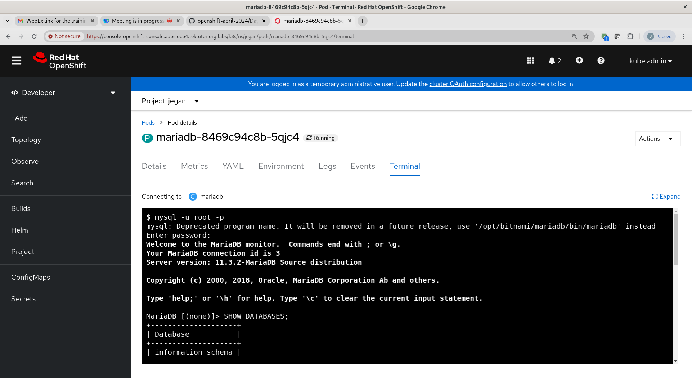
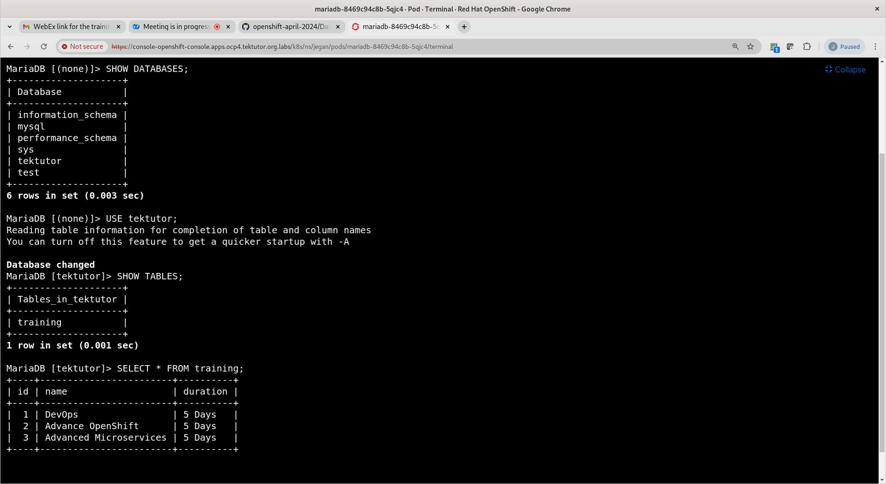

# Day 2

## Info - Troubleshooting web console
In case, you are able to list the nodes in the openshift cluster but the web console is not accessible.

```
oc -n openshift-console get service
oc -n openshift-console get pods

oc -n openshift-ingress get pod -o json |
  jq -r '.items[].metadata.name' |
  xargs oc -n openshift-ingress delete pod

oc -n openshift-console get pods -o wide -w

oc -n openshifconsole get service

oc get route --all-namespaces | grep console

oc describe console -n openshift-console
```

<pre>
[jegan@tektutor.org ~]$ oc -n openshift-console get service
NAME        TYPE        CLUSTER-IP       EXTERNAL-IP   PORT(S)   AGE
console     ClusterIP   172.30.93.1      <none>        443/TCP   19h
downloads   ClusterIP   172.30.113.169   <none>        80/TCP    19h

[jegan@tektutor.org ~]$ oc -n openshift-console get pods
NAME                         READY   STATUS    RESTARTS   AGE
console-7644f4994f-449vg     1/1     Running   0          19h
console-7644f4994f-gm8qk     1/1     Running   0          19h
downloads-86d9bcf76d-9tmjm   1/1     Running   0          19h
downloads-86d9bcf76d-xzkm2   1/1     Running   0          19h

[jegan@tektutor.org ~]$ oc -n openshift-ingress get pod -o json |
  jq -r '.items[].metadata.name' |
  xargs oc -n openshift-ingress delete pod
pod "router-default-6fbc577945-lrcj5" deleted
pod "router-default-6fbc577945-rhzv8" deleted
pod "router-default-6fbc577945-zfgwp" deleted

[jegan@tektutor.org ~]$ oc -n openshift-console get pods
NAME                         READY   STATUS              RESTARTS   AGE
console-7644f4994f-449vg     0/1     ContainerCreating   1          19h
console-7644f4994f-gm8qk     0/1     ContainerCreating   1          19h
downloads-86d9bcf76d-9tmjm   0/1     ContainerCreating   1          19h
downloads-86d9bcf76d-xzkm2   0/1     ContainerCreating   1          19h

[jegan@tektutor.org ~]$ oc -n openshift-console get pods -w
NAME                         READY   STATUS              RESTARTS   AGE
console-7644f4994f-449vg     0/1     ContainerCreating   1          19h
console-7644f4994f-gm8qk     0/1     ContainerCreating   1          19h
downloads-86d9bcf76d-9tmjm   0/1     ContainerCreating   1          19h
downloads-86d9bcf76d-xzkm2   0/1     ContainerCreating   1          19h
console-7644f4994f-449vg     0/1     Running             1          19h

^C[jegan@tektutor.org ~]$ oc -n openshift-console get pods -w -o wide
NAME                         READY   STATUS              RESTARTS   AGE   IP            NODE                              NOMINATED NODE   READINESS GATES
console-7644f4994f-449vg     0/1     Running             1          19h   10.130.0.23   master-3.ocp4.tektutor.org.labs   <none>           <none>
console-7644f4994f-gm8qk     0/1     ContainerCreating   1          19h   <none>        master-1.ocp4.tektutor.org.labs   <none>           <none>
downloads-86d9bcf76d-9tmjm   0/1     ContainerCreating   1          19h   <none>        master-1.ocp4.tektutor.org.labs   <none>           <none>
downloads-86d9bcf76d-xzkm2   0/1     ContainerCreating   1          19h   <none>        master-3.ocp4.tektutor.org.labs   <none>           <none>
console-7644f4994f-449vg     1/1     Running             1          19h   10.130.0.23   master-3.ocp4.tektutor.org.labs   <none>           <none>
console-7644f4994f-gm8qk     0/1     Running             1          19h   10.128.0.56   master-1.ocp4.tektutor.org.labs   <none>           <none>
console-7644f4994f-gm8qk     1/1     Running             1          19h   10.128.0.56   master-1.ocp4.tektutor.org.labs   <none>           <none>

^C[jegan@tektutor.org ~]$ oc -n openshifconsole get service
NAME        TYPE        CLUSTER-IP       EXTERNAL-IP   PORT(S)   AGE
console     ClusterIP   172.30.93.1      <none>        443/TCP   19h
downloads   ClusterIP   172.30.113.169   <none>        80/TCP    19h

[jegan@tektutor.org ~]$ oc get route --all-namespaces | grep console
openshift-console          console                   console-openshift-console.apps.ocp4.tektutor.org.labs                                  console             https   reencrypt/Redirect     None
openshift-console          downloads                 downloads-openshift-console.apps.ocp4.tektutor.org.labs                                downloads           http    edge/Redirect          None
</pre>

## Lab - Deploying an application into openshift using declarative style(using yaml files)

Kubernetes/Openshift supports deploying and managing application in two styles
1. Imperative style ( using commands )
2. Using source code/manifest files(yaml files)

Deleting existing deployments
```
oc project jegan
oc get all
oc delete deploy/nginx svc/nginx
```

Let's auto-generate yaml file to deploy nginx into openshift declaratively
```
oc create deploy nginx --image=bitnami/nginx --replicas=3 --dry-run=client -o yaml
oc create deploy nginx --image=bitnami/nginx --replicas=3 --dry-run=client -o yaml > nginx-deploy.yml
oc apply -f nginx-deploy.yml
oc get deploy,rs,po
```

## Lab - Scale up nginx deployment pod counts to 5 from 3
```
oc get po
```

Edit the nginx-deploy.yml file and update the replicas from 3 to 5 and save it.

Now you may apply as shown below to scale up the nginx deployment to create a total of 5 pods
```
oc apply -f nginx-deploy.yml
oc get po
```

## Lab - Deleting a deployment in declarative style
```
oc get all
oc delete -f nginx-deploy.yml
oc get all
oc expose deploy/nginx --type=ClusterIP --port=8080 --dry-run=client -o yaml > nginx-clusterip-svc.yml
oc expose deploy/nginx --type=ClusterIP --port=8080 --dry-run=client -o yaml > nginx-nodeport-svc.yml
oc expose deploy/nginx --type=ClusterIP --port=8080 --dry-run=client -o yaml > nginx-lb-svc.yml
ls -l
```

Expected output
<pre>
[root@tektutor.org declarative-manifest-scripts]# ls
nginx-deploy.yml
[root@tektutor.org declarative-manifest-scripts]# oc get all
Warning: apps.openshift.io/v1 DeploymentConfig is deprecated in v4.14+, unavailable in v4.10000+
NAME                        READY   STATUS    RESTARTS   AGE
pod/nginx-94c4bd68b-4bqzn   1/1     Running   0          11m
pod/nginx-94c4bd68b-89j2v   1/1     Running   0          5m23s
pod/nginx-94c4bd68b-m8sw7   1/1     Running   0          5m23s
pod/nginx-94c4bd68b-phpjq   1/1     Running   0          11m
pod/nginx-94c4bd68b-x79bn   1/1     Running   0          11m

NAME                    READY   UP-TO-DATE   AVAILABLE   AGE
deployment.apps/nginx   5/5     5            5           11m

NAME                              DESIRED   CURRENT   READY   AGE
replicaset.apps/nginx-94c4bd68b   5         5         5       11m

[root@tektutor.org declarative-manifest-scripts]# oc delete -f nginx-deploy.yml 
deployment.apps "nginx" deleted
  
[root@tektutor.org declarative-manifest-scripts]# oc get all
Warning: apps.openshift.io/v1 DeploymentConfig is deprecated in v4.14+, unavailable in v4.10000+
No resources found in jegan namespace.  
</pre>

## Lab - Auto-generating service manifests file to create them declaratively later
```
ls
oc apply -f nginx-deploy.yml
oc get all
oc expose deploy/nginx --type=ClusterIP --port=8080 --dry-run=client -o yaml
oc get svc
```

Expected output
<pre>
[root@tektutor.org declarative-manifest-scripts]# ls
nginx-deploy.yml
  
[root@tektutor.org declarative-manifest-scripts]# oc apply -f nginx-deploy.yml 
deployment.apps/nginx created
  
[root@tektutor.org declarative-manifest-scripts]# oc get all
Warning: apps.openshift.io/v1 DeploymentConfig is deprecated in v4.14+, unavailable in v4.10000+
NAME                        READY   STATUS              RESTARTS   AGE
pod/nginx-94c4bd68b-96ttl   1/1     Running             0          3s
pod/nginx-94c4bd68b-m6zl6   0/1     ContainerCreating   0          3s
pod/nginx-94c4bd68b-pnvpx   1/1     Running             0          3s
pod/nginx-94c4bd68b-rbpfm   1/1     Running             0          3s
pod/nginx-94c4bd68b-rtrm8   1/1     Running             0          3s

NAME                    READY   UP-TO-DATE   AVAILABLE   AGE
deployment.apps/nginx   4/5     5            4           3s

NAME                              DESIRED   CURRENT   READY   AGE
[root@tektutor.org declarative-manifest-scripts]# oc expose deploy/nginx --type=ClusterIP --port=8080 --dry-run=client -o yaml
apiVersion: v1
kind: Service
metadata:
  creationTimestamp: null
  labels:
    app: nginx
  name: nginx
spec:
  ports:
  - port: 8080
    protocol: TCP
    targetPort: 8080
  selector:
    app: nginx
  type: ClusterIP
status:
  loadBalancer: {}
  
[root@tektutor.org declarative-manifest-scripts]# oc expose deploy/nginx --type=ClusterIP --port=8080 --dry-run=client -o yaml > nginx-clusterip-svc.yml
  
[root@tektutor.org declarative-manifest-scripts]# ls
nginx-clusterip-svc.yml  nginx-deploy.yml
  
[root@tektutor.org declarative-manifest-scripts]# oc expose deploy/nginx --type=NodePort --port=8080 --dry-run=client -o yaml > nginx-nodeport-svc.yml
  
[root@tektutor.org declarative-manifest-scripts]# oc expose deploy/nginx --type=LoadBalancer --port=8080 --dry-run=client -o yaml > nginx-lb-svc.yml
  
[root@tektutor.org declarative-manifest-scripts]# ls -l
total 16
-rw-r--r-- 1 root root 245 Apr 16 14:26 nginx-clusterip-svc.yml
-rw-r--r-- 1 root root 293 Apr 16 14:19 nginx-deploy.yml
-rw-r--r-- 1 root root 248 Apr 16 14:27 nginx-lb-svc.yml
-rw-r--r-- 1 root root 244 Apr 16 14:26 nginx-nodeport-svc.yml
</pre>

## Lab - Create a clusterip internal service declaratively
```
oc get deploy,rs,po
oc get svc
oc apply -f nginx-clusterip-svc.yml
oc get svc
```

Expected output
<pre>
  
</pre>

## Lab - Create a nodeport external service declaratively
```
oc get deploy,rs,po
oc get svc
oc apply -f nginx-nodeport-svc.yml
oc get svc
```

Expected output
<pre>
  
</pre>

## Lab - Create a loadbalancer external service declaratively
```
oc get deploy,rs,po
oc get svc
oc apply -f nginx-lb-svc.yml
oc get svc
```

Expected output
<pre>
  
</pre>


## Lab - Creating a route to expose your application to access them outside the cluster
In Openshift, to expose a service within the cluster ClusterIP service is created and for external use route is created. 

```
oc get all
oc expose deploy/nginx --port=8080
oc get svc
oc expose svc/nginx
oc get routes
curl http://nginx-jegan.apps.ocp4.tektutor.org.labs
```

Expected output
```
[root@tektutor.org declarative-manifest-scripts]# oc get all
Warning: apps.openshift.io/v1 DeploymentConfig is deprecated in v4.14+, unavailable in v4.10000+
NAME                        READY   STATUS    RESTARTS   AGE
pod/nginx-94c4bd68b-7gcfp   1/1     Running   0          30m
pod/nginx-94c4bd68b-lsqqg   1/1     Running   0          30m
pod/nginx-94c4bd68b-r55ns   1/1     Running   0          30m

NAME                    READY   UP-TO-DATE   AVAILABLE   AGE
deployment.apps/nginx   3/3     3            3           30m

NAME                              DESIRED   CURRENT   READY   AGE
replicaset.apps/nginx-94c4bd68b   3         3         3       30m

[root@tektutor.org declarative-manifest-scripts]# oc expose deploy/nginx --port=8080
service/nginx exposed
[root@tektutor.org declarative-manifest-scripts]# oc get svc
NAME    TYPE        CLUSTER-IP       EXTERNAL-IP   PORT(S)    AGE
nginx   ClusterIP   172.30.134.110   <none>        8080/TCP   4s

[root@tektutor.org declarative-manifest-scripts]# oc expose svc/nginx
route.route.openshift.io/nginx exposed

[root@tektutor.org declarative-manifest-scripts]# oc get route
NAME    HOST/PORT                                 PATH   SERVICES   PORT   TERMINATION   WILDCARD
nginx   nginx-jegan.apps.ocp4.tektutor.org.labs          nginx      8080                 None

[root@tektutor.org declarative-manifest-scripts]# curl http://nginx-jegan.apps.ocp4.tektutor.org.labs
<!DOCTYPE html>
<html>
<head>
<title>Welcome to nginx!</title>
<style>
    body {
        width: 35em;
        margin: 0 auto;
        font-family: Tahoma, Verdana, Arial, sans-serif;
    }
</style>
</head>
<body>
<h1>Welcome to nginx!</h1>
<p>If you see this page, the nginx web server is successfully installed and
working. Further configuration is required.</p>

<p>For online documentation and support please refer to
<a href="http://nginx.org/">nginx.org</a>.<br/>
Commercial support is available at
<a href="http://nginx.com/">nginx.com</a>.</p>

<p><em>Thank you for using nginx.</em></p>
</body>
</html>
```

## Ingress
<pre>
- is a routing/forwarding rule
- we can define routing forwarding rule using a kubernetes/openshift resource called Ingress
- there is a controller which manages Ingress resources called Ingress Controller
- Openshift Ingress Controller constantly monitors new Ingress resources created anywhere in the openshift cluster
- Whenever the Ingress Controller get to know about a new Ingress resource, it fetches ingress routing rules and then it configures the Load balancer with those routing rules

- For an Ingress to work, we need 3 types of resources
  1. Ingress ( Routing rule )
  2. Ingress Controller
     - This can be Nginx Ingress Controller or
     - can be HAProxy Ingress Controller
  3. Load Balancer ( HAProxy or Nginx )
</pre>

Let's there is a home for Tektutor website

Ingress (Routing rule)
Home Page - http://www.tektutor.org
Rule 1 - http://www.tektutor.org/trainings
  - this should be forwarded to training service (openshift service - clusterip,nodeport,loadbalancer)
Rule 2 - https://www.tektutor.org/logout
  - this should be forwarded to logout service (openshift service - clusterip,nodeport,loadbalancer)

Ingress Controller has to pick the above Ingress rules, and it will configure a Load Balancer 

You can refer my medium blog about Ingress here
<pre>
https://medium.com/@jegan_50867/redhat-openshift-ingress-e91f27a35773  
</pre>

## Lab - Understanding Ingress
You need to find your openshift cluster domain and adjust the host url accordingly
```
oc describe ingresscontroller/default -n openshift-ingress-operator | grep Domain:
```

Expected output
<pre>
oc describe ingresscontroller/default -n openshift-ingress-operator | grep Domain:
  Domain:                  apps.ocp4.rpsconsulting.in  
</pre>

You need to update the ingress.yml file and replace host url to tektutor.apps.ocp4.rpsconsulting.in

```
cd ~/openshift-april-2024
git pull
cd Day2/ingress

oc apply -f nginx-deploy.yml
oc apply -f hello-deploy.yml
oc get deploy,rs,po

oc apply -f nginx-clusterip-svc.yml
oc apply -f hello-clusterip-svc.yml
oc get svc

oc apply -f ingress.yml
oc get ingress
oc describe ingress/tektutor

curl http://tektutor.apps.ocp4.rpsconsulting.in/nginx
curl http://tektutor.apps.ocp4.rpsconsulting.in/hello
```

## Info - What is Persistent Volume (PV)?
- is an external storage created by System Administrator (openshift administrator)
- the Persistent volumes are created in the cluster scope, hence it can be claimed and used by any openshift project
- the Persistent volumes will refer to externals disk created from resources like
  - NFS Storage ( In our case we will use NFS shared external storage )
  - AWS EBS
  - Azure Storage
- In our lab, each server
  - Server 1 (10.10.15.60) has its own NFS Server (user01 to user09)
  - Server 2 (10.10.15.63) has its own NFS Server (user10 to user17)
  - Server 3 (10.10.15.64) has its own NFS Server (user18 to user25)
- You can list the NFS shared folder for your linux user as shown below in the linux terminal
  ```
  showmount -e | grep user01
  showmount -e | grep user18
  showmount -e | grep user25
  ```
- Persistent volumes we create in Openshift will be making use of NFS Shared folders
- Persistent Volumes normally will have the below attributes
  - Capacity/Size in MB/GB/TB/MiB/GiB/TiB
  - AccessMode - ReadOnlyOnce,ReadWriteOnce, ReadWriteOnce, ReadWriteMany, etc
  - StorageClass - optional ( NFS, AWS, Azure, etc.,)
  - Label selector - optional

- Access Mode
  - ReadOnlyOnce - means all the Pods from a single Node in Openshift cluster can read the Persistent Volume
  - ReadOnlyMany - means all the Pods from any Node in Openshift cluster can read the Persistent Volume
  - ReadWriteOnce - means all the Pods from a single Node in Openshift cluster can read/write the Persistent Volume
  - ReadWriteMany - means all the Pods from multiple Nodes in Openshift cluster can read/write the Persistent Volume
    
## Info - What is Persistent Volume Claim (PVC)?
- any application that runs in Openshift/Kubernetes, if they need external storage they have to request the openshift cluster by creating Persistent volume claims (PVC)
- When application request for external storage by creating PVC, the PVC will also mention the below attributes
  - Size
  - AccessMode
  - StorageClass - optional
  - Label selector - optional
- If openshift storage controller finds a matching Persistent Volume, then it will let the PVC claim/bound and use the Persistent Volume
- The application Deployment that refers the PVC can make use of the external storage by mentioning the PVC name and mount the Persistent volume to a specific mount point(folder in Pod)

For more details on the PersistentVolume and PersistentVolumeClaim accessmode, you may refer the official documentation 
<pre>
https://kubernetes.io/docs/concepts/storage/persistent-volumes/#access-modes  
</pre>

## Lab - Deploying mariab with Persistent Volume and Claims

Before you create the below resources, you need to edit mariadb-pv.yml mariadb-pvc.yml and mariadb-deploy.yml to customize as per your linux server IP, replace the nfs path with your mariadb nfs path, replace 'jegan' with your name.

```
cd ~/openshift-april-2024
git pull
cd Day2/persistent-volumes-and-claims/

oc apply -f mariadb-pv.yml
oc apply -f mariadb-pvc.yml
oc apply -f mariadb-deploy.yml

oc get po -w
```

You can get inside the mariadb pod shell, when prompts for password type 'root@123'
```
mysql -u root -p
SHOW DATABASES;
CREATE DATABASE tektutor;
USE tektutor;
CREATE TABLE training ( id INT NOT NULL, name VARCHAR(250) NOT NULL, duration VARCHAR(250) NOT NULL, PRIMARY KEY(id));

INSERT INTO training VALUES ( 1, "DevOps", "5 Days" );
INSERT INTO training VALUES ( 2, "OpenShift", "5 Days" );
INSERT INTO training VALUES ( 3, "Microservices", "5 Days" );

SELECT * FROM training;

exit
exit
```





## Lab - Connecting to mariadb pod from linux terminal
```
oc project jegan
oc get po
oc rsh pod/mariadb-8469c94c8b-m4gmj
exit
```

Expected output
<pre>
[root@tektutor.org persistent-volumes-and-claims]# oc project jegan
Already on project "jegan" on server "https://api.ocp4.tektutor.org.labs:6443".
[root@tektutor.org persistent-volumes-and-claims]# 
  
[root@tektutor.org persistent-volumes-and-claims]# oc get po
NAME                       READY   STATUS    RESTARTS   AGE
mariadb-8469c94c8b-m4gmj   1/1     Running   0          13m
nginx-57fb4c94dc-2qj52     1/1     Running   0          69s
nginx-57fb4c94dc-7fpk6     1/1     Running   0          69s
nginx-57fb4c94dc-knmk7     1/1     Running   0          69s
  
[root@tektutor.org persistent-volumes-and-claims]# oc rsh pod/mariadb-8469c94c8b-m4gmj
$ mysql -u root -p
mysql: Deprecated program name. It will be removed in a future release, use '/opt/bitnami/mariadb/bin/mariadb' instead
Enter password: 
Welcome to the MariaDB monitor.  Commands end with ; or \g.
Your MariaDB connection id is 4
Server version: 11.3.2-MariaDB Source distribution

Copyright (c) 2000, 2018, Oracle, MariaDB Corporation Ab and others.

Type 'help;' or '\h' for help. Type '\c' to clear the current input statement.

MariaDB [(none)]> SHOW DATABASES;
+--------------------+
| Database           |
+--------------------+
| information_schema |
| mysql              |
| performance_schema |
| sys                |
| tektutor           |
| test               |
+--------------------+
6 rows in set (0.002 sec)

MariaDB [(none)]> exit        
Bye
$ exit  
</pre>
