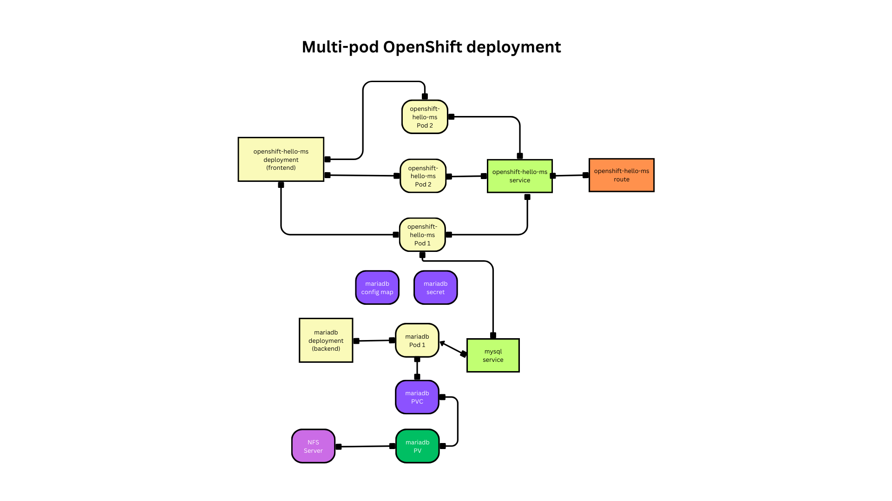
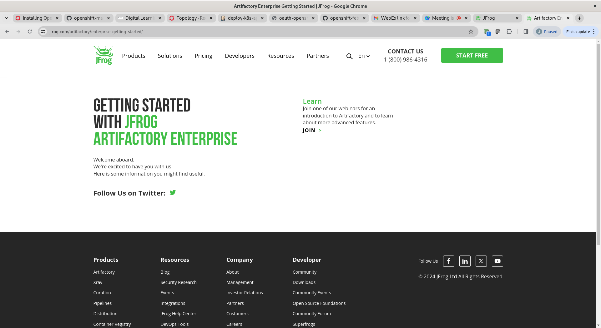
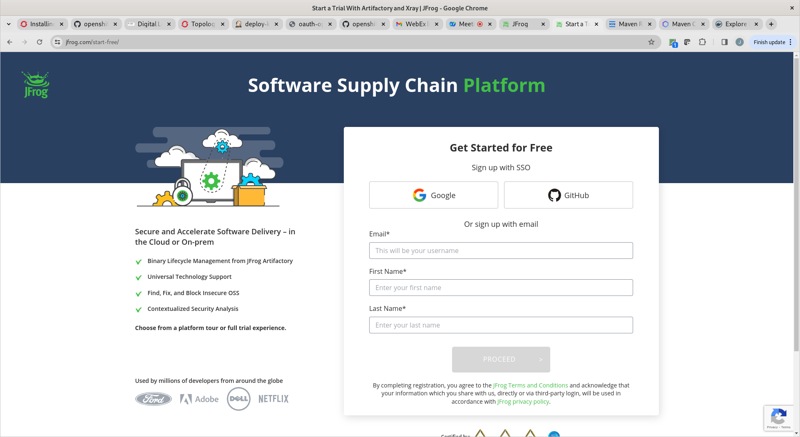
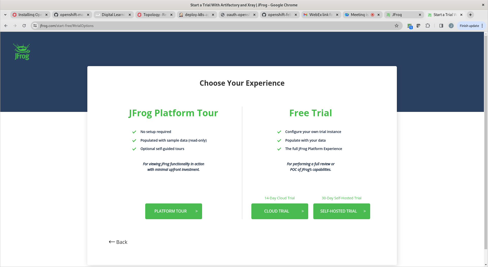
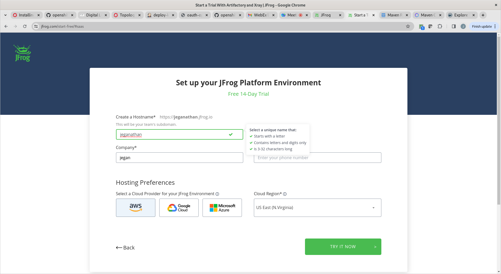

# Day 3

## Info - Deployment vs DeploymentConfig

- In older version of Kubernetes, to deploy applications, we had to use ReplicationController
- ReplicationController supports
  - Scale up/down
  - Rolling update
  - it doesn't support declarative application deployment
  - during this time, OpenShift introducted a new type of Resource called DeploymentConfig to deploy applications, deploymentconfig pretty much does what Deployment and ReplicaSet does today
  - meanwhile, Kubernetes new versions introducted Deployment and Replicaset as an alternate to ReplicationController
  - Deployment & ReplicaSet
    - supports scale up/down
    - supports rolling update
    - its supports creating deployment in imperative and declarative style
    - in new version of K8s and OpenShift, it is recommended to use Deployment over the DeploymentConfig
  - ReplicationController and Deploymentconfig are deprecated in Openshift but exists for backward compatibility

## Installing Helm Kubernetes/OpenShift Package Manager
Helm is already installed on Server1, Server2 and Server 3 for all users. Hence, the below instructions are just for your reference. This requires administrator privilege on the linux machine.

```
curl -fsSL -o get_helm.sh https://raw.githubusercontent.com/helm/helm/main/scripts/get-helm-3
chmod 700 get_helm.sh
./get_helm.sh
```

# Bonus Labs (Optional - not in our training agenda)

## Lab - Finding more details about Openshift private image registry
Red Hat Openshift comes with a private Container Registry out of the box.  You may try extracting more details about the openshift image registry as shown below

```
oc describe svc/image-registry -n openshift-image-registry
```

Expected output
<pre>
[jegan@tektutor.org openshift-april-2024]$ oc describe svc/image-registry -n openshift-image-registry
Name:              image-registry
Namespace:         openshift-image-registry
Labels:            docker-registry=default
Annotations:       imageregistry.operator.openshift.io/checksum: sha256:1c19715a76014ae1d56140d6390a08f14f453c1a59dc36c15718f40c638ef63d
                   service.alpha.openshift.io/serving-cert-secret-name: image-registry-tls
                   service.alpha.openshift.io/serving-cert-signed-by: openshift-service-serving-signer@1710727234
                   service.beta.openshift.io/serving-cert-signed-by: openshift-service-serving-signer@1710727234
Selector:          docker-registry=default
Type:              ClusterIP
IP Family Policy:  SingleStack
IP Families:       IPv4
IP:                172.30.193.120
IPs:               172.30.193.120
Port:              5000-tcp  5000/TCP
TargetPort:        5000/TCP
Endpoints:         10.128.0.38:5000
Session Affinity:  None
Events:            <none>  
</pre>

## Lab - In case you are curious to see how does the etcd key/value data-store stores the data in openshift
In the below commands, replace 'jegan' with your project name(your name)

```
oc project openshift-etcd
oc rsh po/etcd-master-1.ocp4.tektutor.org.labs
etcdctl get "" --keys-only --prefix=true
etcdctl get "" --keys-only --prefix=true | grep jegan
etcdctl get "/kubernetes.io/deployments/jegan/mariadb" --prefix=true
etcdctl get "/kubernetes.io/pods/jegan/mariadb-8469c94c8b-tf65s" --prefix=true
```

## Lab - Deploying a multipod java application that fetch data from mariadb database


```
cd ~/openshift-april-2024
git pull

cd Day3/hello-microservice
oc apply -f configmap.yml
oc apply -f secrets.yml
oc apply -f mariadb-pv.yml
oc apply -f mariadb-pvc.yml
oc apply -f mariadb-deploy.yml
oc apply -f mariadb-svc.yml

oc apply -f openshift-helloms-deploy.yml
oc apply -f openshift-helloms-svc.yml
oc apply -f openshift-helloms-route.yml
```

You can connect to mariadb pod shell as shown below, when it prompts for password type 'root@123'
```
oc rsh pod/mariadb-7889ddc665-9kskb
mysql -u root -p
CREATE DATABASE tektutor;
USE tektutor;
CREATE TABLE greeting ( message VARCHAR(100) NOT NULL );
INSERT INTO greeting VALUES ( "Hello Microservice 1.0 !" );
SELECT * FROM greeting;
```

Now you should be able to access the openshift helloms route from cli or web browser.  You need to use your route url which might look like http://openshift-hello-ms-<your-name>.apps.ocp4.rpsconsulting.in
```
oc get route
curl http://openshift-hello-ms-jegan.apps.ocp4.tektutor.org.labs
```

## Lab - Deploying multipod wordpress application
You need to update mariadb-pv.yml, mariadb-pvc.yml, mariadb-deploy.yml, wordpress-pv.yml wordpress-pvc.yml and wordpress-deploy.yml before applying.

```
cd ~/openshift-april-2024
git pull

cd Day3/wordpress
./deploy.sh
```

You can access the wordpress from Developer Context --> Topology and click on the route(up arrow) that appears on the wordpress deployment.  You are supposed to see the wordpress blog page.

Once you are done with this lab exercise, it is recommended to delete the wordpress deployment to free up the resources

```
cd ~/openshift-april-2024
git pull

cd Day3/wordpress
./delete.sh
```

## Lab - Creating a daemonset

This will create one nginx pod per node automatically. If additional nodes are added to the openshift cluster, the daemonset controller will automatically create a new pod and assign it on the new node, on the similar fashion if a node is removed from the cluseter, the daemonset pod get deleted automatically from the node.

Example for Daemonset
- kube-proxy that supports load-balancing functionality to the pods behind Service has to be deployed on each node ( One kube-proxy per node )
- CoreDNS pod that supports service discovery functionality has to be deployed on each node ( one pod per node )
- Prometheus pod that collects performance metrics has to be deployed on each node ( one pod per node )

We will try to deploy one nginx pod per node by creating the below daemonset
```
cd  ~/openshift-april-2024
git pull

cd Day3/daemonset
oc apply -f nginx-ds.yml
```

Expected output
<pre>
[root@tektutor.org Day3]# <b>cd daemonset/</b>
[root@tektutor.org daemonset]# <b>ls</b>
nginx-ds.yml
  
[root@tektutor.org daemonset]# <b>oc apply -f nginx-ds.yml</b>
daemonset.apps/nginx created
  
[root@tektutor.org daemonset]# <b>oc get po</b>
NAME          READY   STATUS              RESTARTS   AGE
nginx-f29f6   0/1     ContainerCreating   0          2s
nginx-ffsqw   0/1     ContainerCreating   0          2s
nginx-hgrdb   0/1     ContainerCreating   0          2s
nginx-r97pv   0/1     ContainerCreating   0          2s
nginx-zstvs   0/1     ContainerCreating   0          2s
  
[root@tektutor.org daemonset]# <b>oc get po -w -o wide</b>
NAME          READY   STATUS              RESTARTS   AGE   IP             NODE                              NOMINATED NODE   READINESS GATES
nginx-f29f6   0/1     ContainerCreating   0          7s    <none>         master-1.ocp4.tektutor.org.labs   <none>           <none>
nginx-ffsqw   1/1     Running             0          7s    10.131.0.82    worker-2.ocp4.tektutor.org.labs   <none>           <none>
nginx-hgrdb   1/1     Running             0          7s    10.128.2.17    worker-1.ocp4.tektutor.org.labs   <none>           <none>
nginx-r97pv   0/1     ContainerCreating   0          7s    <none>         master-3.ocp4.tektutor.org.labs   <none>           <none>
nginx-zstvs   1/1     Running             0          7s    10.129.0.218   master-2.ocp4.tektutor.org.labs   <none>           <none>
nginx-f29f6   1/1     Running             0          15s   10.128.0.217   master-1.ocp4.tektutor.org.labs   <none>           <none>
nginx-r97pv   1/1     Running             0          15s   10.130.0.68    master-3.ocp4.tektutor.org.labs   <none>           <none>
  
^C[root@tektutor.org daemonset]# <b>oc get po</b>
NAME          READY   STATUS    RESTARTS   AGE
nginx-f29f6   1/1     Running   0          18s
nginx-ffsqw   1/1     Running   0          18s
nginx-hgrdb   1/1     Running   0          18s
nginx-r97pv   1/1     Running   0          18s
nginx-zstvs   1/1     Running   0          18s
  
[root@tektutor.org daemonset]# <b>cat nginx-ds.yml</b>
apiVersion: apps/v1
kind: DaemonSet
metadata:
  labels:
    app: nginx
  name: nginx
spec:
  selector:
    matchLabels:
      app: nginx
  template:
    metadata:
      labels:
        app: nginx
    spec:
      containers:
      - image: bitnami/nginx:latest
        name: nginx
</pre>

## Setup your trial JFrog Artifactory to configure OpenShift Private Container Registry
```
https://jfrog.com/start-free/
```

With your gmail, you can create 14 days trial.
On your Web browser, navigate to the below url
<pre>
https://jfrog.com/artifactory/enterprise-getting-started/
</pre>

Expected output

Click on "Start Free" button in the top right corner of the web page to get the below page

Click on Google to get the below page

Click on "Cloud Trial" and go with aws public cloud



## Lab - JFrog Private Docker Registry (Quick Test once you setup your JFrog Private Docker Registry)
```
docker login -ujegan@tektutor.org tektutor.jfrog.io
docker pull tektutor.jfrog.io/tektutor-docker/hello-world:latest
docker tag tektutor.jfrog.io/tektutor-docker/hello-world tektutor.jfrog.io/tektutor-docker/hello-world:1.0.0
docker push tektutor.jfrog.io/tektutor-docker/hello-world:1.0.0
```

Expected output
<pre>
[jegan@tektutor.org ~]$ docker login -ujegan@tektutor.org tektutor.jfrog.io
Password: 
WARNING! Your password will be stored unencrypted in /home/jegan/.docker/config.json.
Configure a credential helper to remove this warning. See
https://docs.docker.com/engine/reference/commandline/login/#credentials-store

Login Succeeded
  
[jegan@tektutor.org ~]$ sudo su jegan
[sudo] password for jegan: 
[jegan@tektutor.org ~]$ docker pull tektutor.jfrog.io/tektutor-docker/hello-world:latest
latest: Pulling from tektutor-docker/hello-world
c1ec31eb5944: Pull complete 
Digest: sha256:53641cd209a4fecfc68e21a99871ce8c6920b2e7502df0a20671c6fccc73a7c6
Status: Downloaded newer image for tektutor.jfrog.io/tektutor-docker/hello-world:latest
tektutor.jfrog.io/tektutor-docker/hello-world:latest
  
[jegan@tektutor.org ~]$ docker tag tektutor.jfrog.io/tektutor-docker/hello-world tektutor.jfrog.io/tektutor-docker/hello-world:1.0.0
  
[jegan@tektutor.org ~]$ docker push tektutor.jfrog.io/tektutor-docker/hello-world:1.0.0
The push refers to repository [tektutor.jfrog.io/tektutor-docker/hello-world]
ac28800ec8bb: Layer already exists 
1.0.0: digest: sha256:d37ada95d47ad12224c205a938129df7a3e52345828b4fa27b03a98825d1e2e7 size: 524  
</pre>

## Lab - Building a Custom Docker Image and pushing to JFrog Private Docker Registry
```
cd ~/openshift-april-2024
git pull
cd Day3/spring-ms
docker build -t tektutor/hello-microservice:1.0 .
docker images
```

Expected output
<pre>
[jegan@tektutor.org spring-ms]$ ls -l
total 8
-rw-r--r--. 1 jegan jegan  217 Mar 22 10:31 Dockerfile
-rw-r--r--. 1 jegan jegan 1715 Mar 21 19:44 pom.xml
drwxr-xr-x. 3 jegan jegan   18 Mar 21 19:44 src

    
[jegan@tektutor.org spring-ms]$ # Build custom docker image with sample spring boot microservice
[jegan@tektutor.org spring-ms]$ <b>docker build -t tektutor/hello-microservice:1.0 .</b>
[+] Building 2.3s (11/11) FINISHED                                                               docker:default
 => [internal] load build definition from Dockerfile                                                       0.0s
 => => transferring dockerfile: 315B                                                                       0.0s
 => [internal] load metadata for registry.access.redhat.com/ubi8/openjdk-11:latest                         0.8s
 => [internal] load metadata for docker.io/library/maven:3.6.3-jdk-11                                      2.2s
 => [internal] load .dockerignore                                                                          0.0s
 => => transferring context: 2B                                                                            0.0s
 => [stage-1 1/2] FROM registry.access.redhat.com/ubi8/openjdk-11:latest@sha256:285b35387bd04f93bb2ad8a2d  0.0s
 => [internal] load build context                                                                          0.0s
 => => transferring context: 1.25kB                                                                        0.0s
 => [stage1 1/3] FROM docker.io/library/maven:3.6.3-jdk-11@sha256:1d29ccf46ef2a5e64f7de3d79a63f9bcffb4dc5  0.0s
 => CACHED [stage1 2/3] COPY . .                                                                           0.0s
 => CACHED [stage1 3/3] RUN mvn clean package                                                              0.0s
 => CACHED [stage-1 2/2] COPY --from=stage1 target/*.jar app.jar                                           0.0s
 => exporting to image                                                                                     0.0s
 => => exporting layers                                                                                    0.0s
 => => writing image sha256:ec169bcd065873433a41201a6141821e8e155dfea95e9c291592fefb2732c2af               0.0s
 => => naming to docker.io/tektutor/hello-microservice:1.0     
  0.0s
  
[jegan@tektutor.org spring-ms]$ <b>docker images</b>
REPOSITORY                                      TAG       IMAGE ID       CREATED         SIZE
tektutor/hello-microservice                     1.0       ec169bcd0658   15 hours ago    410MB
tektutor.jfrog.io/tektutor-docker/hello-world   1.0.0     d2c94e258dcb   10 months ago   13.3kB
tektutor.jfrog.io/tektutor-docker/hello-world   latest    d2c94e258dcb   10 months ago   13.3kB
  
[jegan@tektutor.org spring-ms]$ <b>docker run -d --name hello --hostname hello -p 80:8080 tektutor/hello-microservice:1.0</b>
bc4bea9f0f746b490650d444842fde6d69c4f84132cbd2c8ed4d3171ff8ced69
  
[jegan@tektutor.org spring-ms]$ <b>docker ps</b>
CONTAINER ID   IMAGE                             COMMAND               CREATED        STATUS        PORTS                                                       NAMES
bc4bea9f0f74   tektutor/hello-microservice:1.0   "java -jar app.jar"   1 second ago   Up 1 second   8443/tcp, 8778/tcp, 0.0.0.0:80->8080/tcp, :::80->8080/tcp   hello
[jegan@tektutor.org spring-ms]$ curl localhost
</pre>

We need to tag the hello-microservice docker image as per your JFrog portal url
```
cd ~/openshift-april-2024
git pull
cd Day3/spring-ms
pwd

docker images
docker tag tektutor/hello-microservice:1.0 tektutor.jfrog.io/tektutor-docker/hello-microservice:1.0
docker images
```

Expected output
<pre>
[jegan@tektutor.org spring-ms]$ pwd
/home/jegan/openshift-april-2024/Day3/spring-ms
  
[jegan@tektutor.org spring-ms]$ <b>docker images</b>
REPOSITORY                                      TAG       IMAGE ID       CREATED         SIZE
tektutor/hello-microservice                     1.0       ec169bcd0658   16 hours ago    410MB
tektutor.jfrog.io/tektutor-docker/hello-world   1.0.0     d2c94e258dcb   10 months ago   13.3kB
tektutor.jfrog.io/tektutor-docker/hello-world   latest    d2c94e258dcb   10 months ago   13.3kB
  
[jegan@tektutor.org spring-ms]$ <b>docker tag tektutor/hello-microservice:1.0 tektutor.jfrog.io/tektutor-docker/hello-microservice:1.0</b>
  
[jegan@tektutor.org spring-ms]$ <b>docker images</b>
REPOSITORY                                             TAG       IMAGE ID       CREATED         SIZE
tektutor/hello-microservice                            1.0       ec169bcd0658   16 hours ago    410MB
tektutor.jfrog.io/tektutor-docker/hello-microservice   1.0       ec169bcd0658   16 hours ago    410MB
tektutor.jfrog.io/tektutor-docker/hello-world          1.0.0     d2c94e258dcb   10 months ago   13.3kB
tektutor.jfrog.io/tektutor-docker/hello-world          latest    d2c94e258dcb   10 months ago   13.3kB  
</pre>

Let's push this image to our JFrog Private Docker Registry as shown below
```
docker image
docker push tektutor.jfrog.io/tektutor-docker/hello-microservice:1.0
```

Expected output
<pre>
[jegan@tektutor.org spring-ms]$ <b>docker push tektutor.jfrog.io/tektutor-docker/hello-microservice:1.0</b>
The push refers to repository [tektutor.jfrog.io/tektutor-docker/hello-microservice]
191a955daa2f: Pushed 
00a9cea1d198: Pushed 
f61c43e793f6: Pushed 
1.0: digest: sha256:04d0d1042191c75c68261d5017d1d10e0ef3f25f003f02916781b20ef6fb5704 size: 955  
</pre>

Let's try deploying our hello-microservice applicaton into Openshift using the image we pushed into your JFrog Artifactory
```
oc new-app --image=tektutor.jfrog.io/tektutor-docker/hello-microservice:1.0
oc get po 
```

Expected output
<pre>
[jegan@tektutor.org spring-ms]$ <b>oc new-app --image=tektutor.jfrog.io/tektutor-docker/hello-microservice:1.0</b>
W0322 12:09:36.522032 3222928 newapp.go:523] Could not find an image stream match for "tektutor.jfrog.io/tektutor-docker/hello-microservice:1.0". Make sure that a container image with that tag is available on the node for the deployment to succeed.
--> Found container image ec169bc (16 hours old) from tektutor.jfrog.io for "tektutor.jfrog.io/tektutor-docker/hello-microservice:1.0"

    Java Applications 
    ----------------- 
    Platform for building and running plain Java applications (fat-jar and flat classpath)

    Tags: builder, java

--> Creating resources ...
    deployment.apps "hello-microservice" created
    service "hello-microservice" created
--> Success
    Application is not exposed. You can expose services to the outside world by executing one or more of the commands below:
     'oc expose service/hello-microservice' 
    Run 'oc status' to view your app.
  
[jegan@tektutor.org spring-ms]$ <b>oc get po -w</b>
NAME                                  READY   STATUS         RESTARTS   AGE
hello-microservice-7dd969c847-6gvsg   0/1     ErrImagePull   0          12s
hello-microservice-7dd969c847-6gvsg   0/1     ImagePullBackOff   0          17s
hello-microservice-7dd969c847-6gvsg   0/1     ErrImagePull       0          31s  
</pre>

In order to download container image from our private JFrog Container Image registry, we need to provide login credentials.  These login credentials we can save in an Openshift secret as shown below
```
oc create secret docker-registry private-jfrog-image-registry --docker-server=tektutor.jfrog.io --docker-username=<replace-this-with-your-jfrog-user-login> --docker-password=<replace-this-with-your-jfrog-access-token>

oc get secrets
```

Expected output
<pre>
[jegan@tektutor.org spring-ms]<b>oc get secrets</b>
NAME                       TYPE                                  DATA   AGE
builder-dockercfg-rsp4w    kubernetes.io/dockercfg               1      23m
builder-token-vz2lv        kubernetes.io/service-account-token   4      23m
default-dockercfg-fnztn    kubernetes.io/dockercfg               1      23m
default-token-g2jbg        kubernetes.io/service-account-token   4      23m
deployer-dockercfg-8tn5r   kubernetes.io/dockercfg               1      23m
deployer-token-fkcfz       kubernetes.io/service-account-token   4      23m
private-jfrog-image-registry    kubernetes.io/dockerconfigjson        1      8m5s  
</pre>

Now you may deploy the hello-microservice in declarative style as shown below
```
cd ~/openshift-april-2024
git pull
cd Day3/spring-ms
oc apply -f hello-microservice-deploy.yml
oc apply -f hello-microservice-svc.yml
oc apply -f hello-microservice-route.yml

oc get po -w
```

Expected output
<pre>
jegan@tektutor.org spring-ms]$ ls
Dockerfile  hello-microservice-deploy.yml  pom.xml  src
[jegan@tektutor.org spring-ms]$ <b>oc apply -f hello-microservice-deploy.yml</b>
deployment.apps/hello created
  
[jegan@tektutor.org spring-ms]$ <b>oc get po -w</b>
NAME                     READY   STATUS              RESTARTS   AGE
hello-7b548bfc5f-chzcn   0/1     ContainerCreating   0          3s
hello-7b548bfc5f-ps872   0/1     ContainerCreating   0          3s
hello-7b548bfc5f-twlnc   0/1     ContainerCreating   0          3s
hello-7b548bfc5f-twlnc   1/1     Running             0          27s
hello-7b548bfc5f-ps872   1/1     Running             0          28s

[jegan@tektutor.org spring-ms]<b>oc get secrets</b>
NAME                       TYPE                                  DATA   AGE
builder-dockercfg-rsp4w    kubernetes.io/dockercfg               1      23m
builder-token-vz2lv        kubernetes.io/service-account-token   4      23m
default-dockercfg-fnztn    kubernetes.io/dockercfg               1      23m
default-token-g2jbg        kubernetes.io/service-account-token   4      23m
deployer-dockercfg-8tn5r   kubernetes.io/dockercfg               1      23m
deployer-token-fkcfz       kubernetes.io/service-account-token   4      23m
private-jfrog-image-registry    kubernetes.io/dockerconfigjson        1      8m5s  
</pre>
